# SpecVerse: Intent Is All You Need

## The Problem

Software development is being transformed by AI. Developers describe what they want in natural language, and AI generates code. This is fast, flexible, and increasingly capable. It's also fundamentally unreliable.

### The Vibe Coding Trap

AI coding tools - Cursor, Copilot, Windsurf, Claude Code - generate code from loose prompts. The same prompt produces different results on different days. There's no schema validating the output against the intent. No way to verify the generated system matches what was asked for. No mechanism to replay a successful generation reliably.

The faster we generate code, the faster we accumulate **architectural drift** - the gap between what was intended and what was built. Every AI-generated function that's "close enough" compounds the problem. What starts as a productivity boost becomes a maintenance liability, because nobody can point to a single document and say "this is what the system is supposed to do."

This is vibe coding: it feels productive, but there's no structural guarantee that what's built matches what was wanted.

### The Limits of Traditional Specification

Previous attempts to solve this problem - UML, formal methods, Model-Driven Architecture - failed for the opposite reason. They were precise but impractical:

- **Too rigid**: Specifications couldn't evolve at the pace of development
- **Too complex**: Learning the specification language was harder than writing the code
- **Disconnected from implementation**: The spec and the code were separate artifacts, so one always drifted from the other
- **Write-once**: Specs were created at the start and abandoned once coding began
- **Not designed for AI consumption**: Traditional specifications were created for human readers alone. They can't be reliably parsed, generated, or reasoned about by AI agents - making them unusable in modern agentic workflows

The result: specifications became shelf-ware. Nobody maintained them because maintaining a spec *and* the code was double the work with no enforced connection between them.

### The Gap

What's missing is a format for describing software systems that is **precise enough for machines** but **natural enough for humans**, that can be **verified automatically**, and that stays **connected to implementation** because it *is* the implementation's source of truth.

SpecVerse is that format.

---

## The Insight: From Non-Deterministic Generation to Verifiable Creation

The core insight behind SpecVerse is that AI-generated software doesn't have to be non-deterministic. The problem isn't that AI generates code - it's that AI generates code **without a verifiable specification to check against**.

If there were a structured format that captured architectural intent - one that both humans and AI could read and write - then:

1. **AI generation becomes verifiable**: Generate a spec, validate it against a schema. Pass or fail. No ambiguity.
2. **Proven solutions become replayable**: When an AI solves a problem well, capture the solution as a deterministic template. Replay it reliably forever - zero tokens, near-instant execution, identical output every time.
3. **Architecture becomes auditable**: The spec is the source of truth. Compare the running system against the spec. If they match, the implementation is faithful. If they diverge, you can see exactly where.

This is the shift from **hallucinogenic generation to verifiable creation**: AI explores non-deterministically, humans verify, and proven solutions crystallise into deterministic, replayable artifacts.

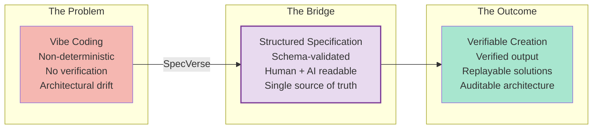

SpecVerse implements this through a two-mode system:

**Generative mode** (the `ai template` command): An LLM generates a solution - a specification, a code template, a deployment configuration. The output is validated against the SpecVerse schema. Errors are automatically fixed through a validate-fix loop until the spec passes 100%. This costs tokens and takes seconds, but produces verified output.

**Deterministic mode** (the `realize` command): A proven solution is captured as an **instance factory** - a deterministic template generator stored in version control. Execution is deterministic, near-instant, costs nothing, and produces identical output every time.

Solutions graduate from generative to deterministic as they mature. When requirements change, they return to generative mode, get re-verified, and are re-captured:

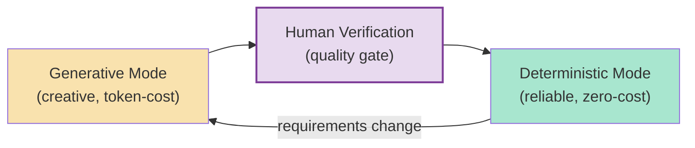

The instance factory templates in SpecVerse - ORM schema generators, API route generators, UI component generators - are themselves **distilled LLM knowledge**: the best solution an AI produced, verified by a human, crystallised for reliable reuse.

---

## The Philosophy

> **Structured intent as the single source of truth.**

Software architecture should be expressed in a single, structured format that serves as the source of truth for both humans and machines. Previous approaches - UML, formal methods, Model-Driven Architecture - provided structure but failed in practice: they were too rigid to evolve, too complex to maintain, and too disconnected from implementation to stay current. Critically, they were never designed for a world where AI agents need to read, write, and reason about specifications alongside humans.

SpecVerse is built for that world. A SpecVerse specification is:

- **Readable** by any developer who can read YAML
- **Writable** by humans and AI systems alike
- **Verifiable** against a formal schema - pass or fail, no ambiguity
- **Precise enough** to generate implementations from, or to execute directly at runtime
- **Extractable** from existing codebases, creating a zero-risk adoption path

It captures the *what* and *why* of a system without dictating the *how*. The same specification can target different ORMs, web frameworks, or UI libraries - technology choices are made in the manifest, not the spec.

---

## The Structure: Four Pillars

The philosophy manifests through four structural capabilities - four directions that specifications can flow between humans and machines:

### Pillar 1: Human-Writable

Developers write specifications naturally using YAML with convention shortcuts:

```yaml
models:
  User:
    attributes:
      email: Email required unique verified
      name: String required
      role: String default=member values=[member, admin, moderator]
    lifecycles:
      account:
        flow: pending -> active -> suspended -> deleted
```

No special tools required. Any developer who can read YAML can read and modify a SpecVerse specification. Conventions like `Email required unique verified` expand into structured schema definitions automatically.

### Pillar 2: AI-Writable

An AI system receives a natural language request - "build me a property management system with bookings, guest profiles, and multi-property support" - and generates a complete, valid specification. The specification is validated against the SpecVerse schema, and any errors are automatically fixed through the validate-fix loop until the spec passes 100%.

### Pillar 3: AI-Describable

An AI system examines an existing codebase - routes, database schemas, UI components - and extracts a specification describing what that system does. This creates an adoption path with zero risk: try SpecVerse on your existing code before committing to it.

### Pillar 4: AI-Implementable

A SpecVerse specification is precise and structured enough that an AI system can generate a working implementation from it - database schemas, API routes, service logic, UI components - targeting whatever technology stack is specified in the manifest.

### The Closed Loop: Verification Through Round-Trip

The four pillars aren't just independent capabilities - they form a **verification loop**:

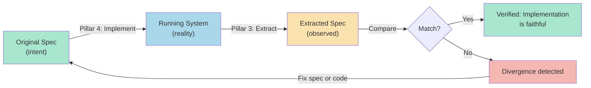

After an AI implements a system from a spec (Pillar 4), you can use Pillar 3 to extract a spec from the running implementation and compare it against the original. If they match, the implementation is faithful to intent. If they diverge, you can see exactly where and decide whether to fix the code or update the spec.

This closes the loop that traditional specification approaches left open. The spec doesn't drift from reality because you can always verify alignment - and the spec format is structured enough that comparison is meaningful, not just a text diff.

### The Workflow

The four pillars combine into a continuous cycle:

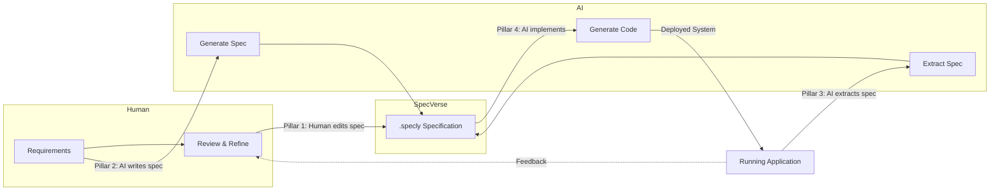

The specification is always the source of truth. Humans and AI both read it, both write it, and the system stays in sync.

---

## Inside a .specly Specification

### Three Architectural Layers

A SpecVerse specification describes a system at three levels of abstraction:

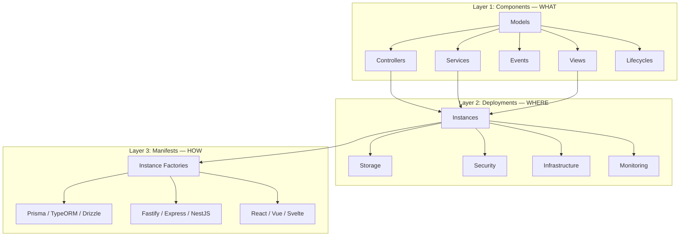

**Components** (Layer 1) define what the system does: data models with attributes and relationships, controllers with CURVED operations (Create, Update, Retrieve, Validate, Evolve, Delete), services with business logic and event subscriptions, views with UI specifications, and lifecycles governing entity state transitions.

**Deployments** (Layer 2) define where it runs: storage instances (databases, caches, queues), security (authentication, authorisation, encryption), infrastructure (gateways, load balancers, CDN), and monitoring (metrics, logging, tracing, alerting).

**Manifests** (Layer 3) define how it's built: instance factories bind abstract capabilities to concrete technologies. The same spec can generate different technology stacks by changing the manifest, not the spec.

### A Minimal Example

```yaml
components:
  BlogSystem:
    version: "3.5.0"
    models:
      Post:
        attributes:
          title: String required
          content: String required
          author: String required
        lifecycles:
          publication:
            flow: draft -> published -> archived
      Comment:
        attributes:
          content: String required
        relationships:
          post: belongsTo Post
```

From these 16 lines, the inference engine generates: PostController and CommentController with full CURVED operations, PostService and CommentService with event subscriptions, lifecycle events (PostPublished, PostArchived), CURVED events (PostCreated, CommentDeleted), and list/detail/form views for both models. The 16-line input becomes a ~80-line complete architecture.

---

## How Specifications Expand

Between a minimal human specification and a complete architecture sits the inference engine: 21 deterministic rules that expand models into controllers, services, events, and views.

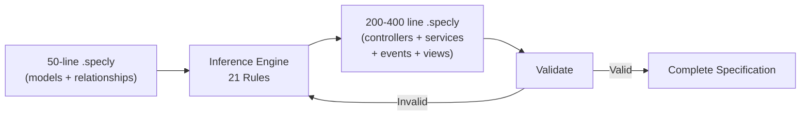

This isn't AI in the LLM sense - it's codified architectural knowledge. The term "inference" here means rule-based deduction, not large language model inference. "Every model with a lifecycle gets an `evolve` operation." "Every `hasMany` relationship generates cascade delete handling." "Every model gets list, detail, and form views." The output is predictable, testable, and version-controlled.

The engine operates purely on the specification format. It reads the three architectural layers, applies its rules, and produces a complete specification that can be validated against the schema. This is what enables the 4x-7.6x expansion ratios measured in practice: a 50-line input describing models and relationships becomes a 200-400 line specification covering the full architecture.

---

## Code Generation: Three Levels

SpecVerse generates code at three levels of sophistication, each building on the last:

### L1: Structural Generation

Scaffold-level output. Models become ORM schemas, controllers get CURVED route stubs, views get component skeletons. Correct structure, placeholder logic. This is what most code generators do.

### L2: Convention-Based Generation

The realize engine resolves **15 convention patterns** to produce working code, not stubs. Each pattern maps a specification construct to a concrete implementation step:

- Model attributes become typed ORM columns with constraints
- Relationships become foreign keys with cascade rules
- Lifecycle flows become state machine implementations with transition validation
- CURVED operations become route handlers with request validation
- Events become typed pub/sub with payload schemas

The same convention patterns apply regardless of target technology. Change the manifest from Prisma to TypeORM, and the conventions produce equivalent output for the new ORM.

### L3: Behavioural Generation

The highest level. Business logic that goes beyond structural patterns:

- **Preconditions**: Guards that must pass before an operation executes
- **Postconditions**: Assertions about state after an operation completes
- **Event emissions**: Domain events triggered by state changes
- **Quint action transpilation**: Formal specifications in Quint (a TLA+ successor) are transpiled into TypeScript runtime guard functions

117 Quint guards have been transpiled into TypeScript runtime functions that enforce the same invariants defined in the formal specification. The guards validate state transitions, enforce business rules, and prevent invalid operations - at runtime, in production, with zero performance overhead from the formal verification tooling.

This is not "generate and hope." The Quint specifications are model-checked by Apalache before transpilation. If an invariant doesn't hold, it fails at verification time, not at runtime.

---

## The Ecosystem

SpecVerse is a multi-repo ecosystem built around the .specly file as the central artifact. The production release is self-hosted: SpecVerse specified itself, generated its own CLI, and that generated CLI is the release.

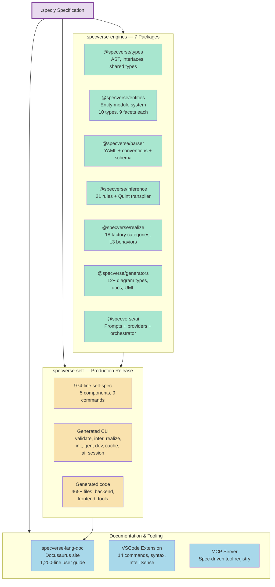

### specverse-engines — The Engine Packages

Seven npm packages at v4.0.0, each implementing the `SpecVerseEngine` interface. Engines are independent and discoverable at runtime via `EngineRegistry`.

**@specverse/types**: Shared type definitions - the SpecVerseAST, engine interfaces, entity module types. Every other package depends on this.

**@specverse/entities**: The entity module system. 10 entity types (6 core: models, controllers, services, events, views, deployments; 4 extensions: commands, conventions, measures, operations), each defined by an entity module with 9 facets:

| Facet | Purpose |
|-------|---------|
| module.yaml | Manifest: name, version, dependencies, facet paths |
| schema/ | JSON Schema fragment: what's valid in .specly syntax |
| conventions/ | Convention processor: shorthand expansion |
| inference/ | Inference rules: what to generate from this entity |
| generators/ | Code generators: instance factory templates |
| behaviour/ | Quint specs: formal invariants and rules |
| behaviour/conventions/ | Behavioural conventions: human-readable to Quint |
| docs/ | Documentation references |
| tests/ | Test references |

Adding a new entity type requires three changes: create the module directory, add a schema property, and register it in the bootstrap. Every engine discovers it automatically.

**@specverse/parser**: Parses .specly files into the SpecVerseAST. YAML parsing, JSON Schema validation (twice - before and after convention processing), convention expansion via entity module processors, semantic validation. The double-validation ensures both the shorthand input and expanded output are schema-valid.

**@specverse/inference**: 21 deterministic rules loaded from entity module JSON files. Expands minimal models into complete architectures with controllers, services, events, views, and deployments. Includes the Quint transpiler that converts formal specifications into TypeScript guard functions.

**@specverse/realize**: Manifest-driven code generation with 18 instance factory categories. Resolves abstract capabilities to concrete technology implementations. Generates backend (Prisma schemas, Fastify routes, service logic), frontend (React components, navigation, forms), CLI (Commander.js commands, session management), and tooling (VSCode extension, MCP server). Supports L1/L2/L3 generation levels.

**@specverse/generators**: Produces 12+ Mermaid diagram types (ER, lifecycle, event flow, architecture layers, deployment topology, capability bindings, technology stacks, class diagrams, UML), auto-generated documentation, and formatted specification output.

**@specverse/ai**: The AI engine - prompt management, LLM provider abstraction (Claude, GPT, local models), orchestration workflows, and session management. Handles the generative mode: requirement analysis, spec generation, validate-fix loops, and materialisation into running applications.

### specverse-self — The Production Release

The definitive proof that SpecVerse works. A 974-line self-specification describing SpecVerse itself - 5 components, 27 models, 9 CLI commands - is processed by the engine packages to produce a complete, working CLI tool.

The generated CLI is not a demo. It is the production release:

- `validate` - Parse and validate .specly files
- `infer` - Expand models into full architecture
- `realize` - Generate code from spec + manifest
- `init` - Create new projects from progressive templates
- `gen` - Generate diagrams, docs, and UML
- `dev` - Development tools (format, watch, quick)
- `cache` - Manage inference caches
- `ai` - AI workflows (docs, suggest, template)
- `session` - Session management for AI interactions

The generated output includes 465+ files: Fastify backend with Prisma ORM and SQLite, React frontend with list/detail/form views, a 14-command VSCode extension, and an MCP server. All CURVED operations work via API and GUI. Lifecycle state machines are enforced at runtime. 117 Quint guards run as TypeScript functions in production.

This is self-hosting in the compiler sense: the tool that generates tools was itself generated by those same tools.

### specverse-lang — Legacy CLI

The original monolithic implementation. Still functional, but superseded by specverse-self. Now serves as the CLI orchestrator that delegates to the engine packages. Retained for backward compatibility and as the npm entry point (`specverse` command).

### The Composition Pipeline

Entity modules aren't monolithic. Each module contributes fragments that are composed at build time into the artifacts the engines consume:

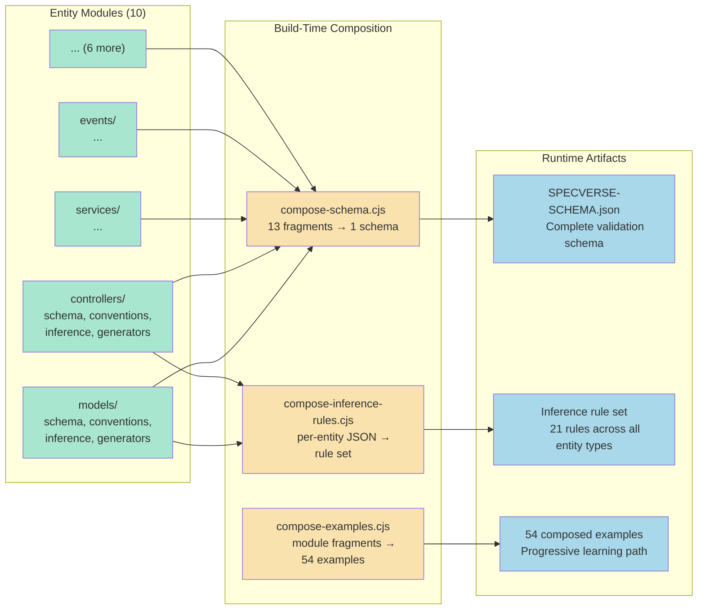

This means adding a new entity type enriches the entire system: its schema fragment gets composed into the validation schema, its inference rules get composed into the rule set, its examples get composed into the learning path. No engine code needs to change.

---

## The Self-Hosting Proof

The strongest evidence that SpecVerse works is that it specified itself, generated itself, and the generated output is the production release.

The proof follows four phases, demonstrated in the specverse-demo-self repository:

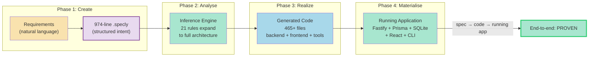

What was proven:

- **CURVED operations**: Create, Update, Retrieve, Validate, Evolve, and Delete all work through both the REST API and the React GUI
- **Both ID strategies**: UUID and Integer primary keys, demonstrating the manifest controls implementation details
- **Lifecycle enforcement**: State machines prevent invalid transitions at runtime
- **L3 behaviors**: Preconditions, postconditions, and events fire correctly
- **Runtime guards**: 117 transpiled Quint guards enforce formal invariants in production TypeScript

The second direction was also proven: given existing generated code, AI can extract a specification from it, and that extracted specification can regenerate equivalent code. This closes the verification loop described in the Four Pillars.

---

## The Ecosystem Map

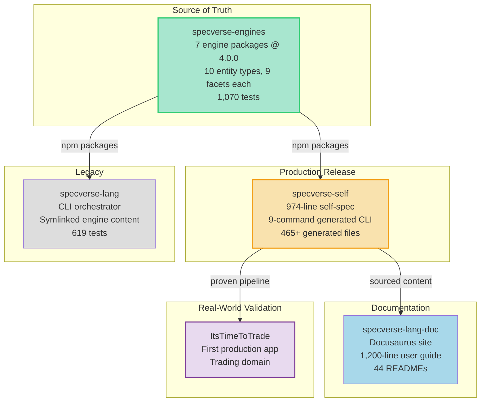

---

## Language Coverage

### What .specly Expresses Today

These domains have well-defined schema primitives, inference rules, and tooling support:

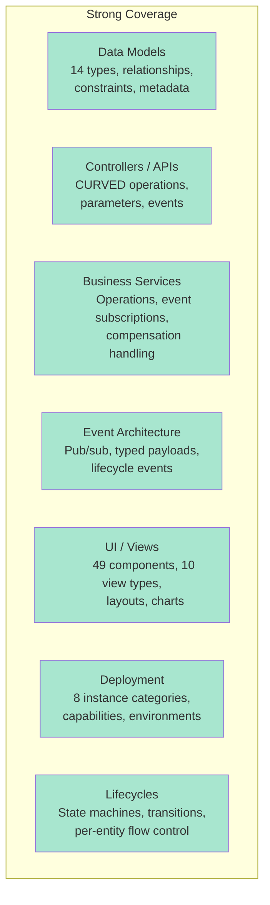

**What this enables**: SaaS applications, entity-centric systems, booking platforms, CMS platforms, project management tools, e-commerce storefronts - any system primarily concerned with entities, their lifecycles, and CURVED operations.

### The Roadmap

The .specly format is designed to be extensible. The following domains are planned additions - they require new schema primitives and inference rules, not architectural changes to the format itself:

| Specification Domain | Coverage | Priority |
|---------------------|----------|----------|
| Data Models & Relationships | Complete | - |
| Controllers / CURVED APIs | Complete | - |
| Business Services & Events | Complete | - |
| UI Views & Components | Complete | - |
| Lifecycle State Machines | Complete | - |
| Deployment Infrastructure | Complete | - |
| **Analytics & Reporting** | **Partial** (measures entity exists) | **High** |
| **External Integrations** | **Partial** (operation policies: retry, circuit breaker, rate limit) | **High** |
| **Data Pipelines** | **Planned** | **Medium** |
| **Workflow Orchestration** | **Planned** | **Medium** |
| Testing & Quality Contracts | Planned | Medium |
| Security Policies (ABAC) | Minimal | Medium |
| Internationalisation | Planned | Low |
| Multi-Tenancy (explicit) | Minimal | Low |
| Configuration Management | Minimal | Low |

The language is excellent for its core domain. The entity module system makes extension incremental: add a module with schema, conventions, inference rules, and generators, and the entire pipeline supports the new entity type without changing any engine code.

See [Appendix A](#appendix-a-coverage-roadmap) for detailed analysis of each planned domain.

---

## What Makes This Different

There are many specification languages (OpenAPI, AsyncAPI, Terraform, Pulumi) and many AI coding tools (Cursor, Copilot, Windsurf). SpecVerse occupies a different space:

**It's not a code generator.** It's a format for expressing software architecture that happens to be implementable. The specification is the artifact, not the generated code. The self-hosting proof demonstrates this: a 974-line spec produces 465+ files of working code, but the spec is the source of truth - regenerate at any time and get identical output.

**It's not an API spec.** OpenAPI describes HTTP endpoints. SpecVerse describes entire systems - models, business logic, events, UI, deployment, and the relationships between them.

**It's not an IaC tool.** Terraform describes infrastructure. SpecVerse describes applications and maps them onto infrastructure through its deployment and manifest layers.

**It generates at three levels.** L1 (structural scaffolding), L2 (convention-based working code from 15 patterns), L3 (behavioural logic with formally verified guards). Most generators stop at L1.

**It's self-hosted.** SpecVerse is the only specification language that has specified itself, generated its own toolchain, and released the generated output as the production version. This isn't a theoretical capability - it's proven and shipping.

**It's a human-AI interface.** The specification format is designed so that humans can write it (Pillar 1), AI can generate it (Pillar 2), AI can extract it from existing systems (Pillar 3), and AI can implement from it (Pillar 4). No other tool is designed for all four.

The bet is that as AI becomes central to software development, the bottleneck shifts from "writing code" to "communicating intent precisely." SpecVerse is purpose-built for that world: one format, one source of truth, readable by humans, writable by machines, verifiable by both.

---

## The Numbers

| Metric | Value |
|--------|-------|
| Engine packages | 7 @ v4.0.0 |
| Entity types | 10 (6 core + 4 extensions) |
| Facets per entity type | 9 |
| Inference rules | 21 deterministic |
| Convention patterns | 15 (L2 generation) |
| Quint guards transpiled | 117 (L3 generation) |
| Instance factory categories | 18 |
| Composed examples | 54 |
| READMEs | 44 |
| User guide | 1,200 lines |
| Self-spec | 974 lines |
| Generated files (self) | 465+ |
| CLI commands (generated) | 9 |
| Diagram types | 12+ |
| Tests (engines) | 1,070 |
| Tests (lang) | 619 |

---

## Appendix A: Coverage Roadmap

The following domains are not yet fully covered by .specly schema primitives. These are roadmap items - planned extensions to the schema and inference engine - not fundamental architectural limitations. The entity module system means each extension is incremental: add a module, and the entire pipeline supports it.

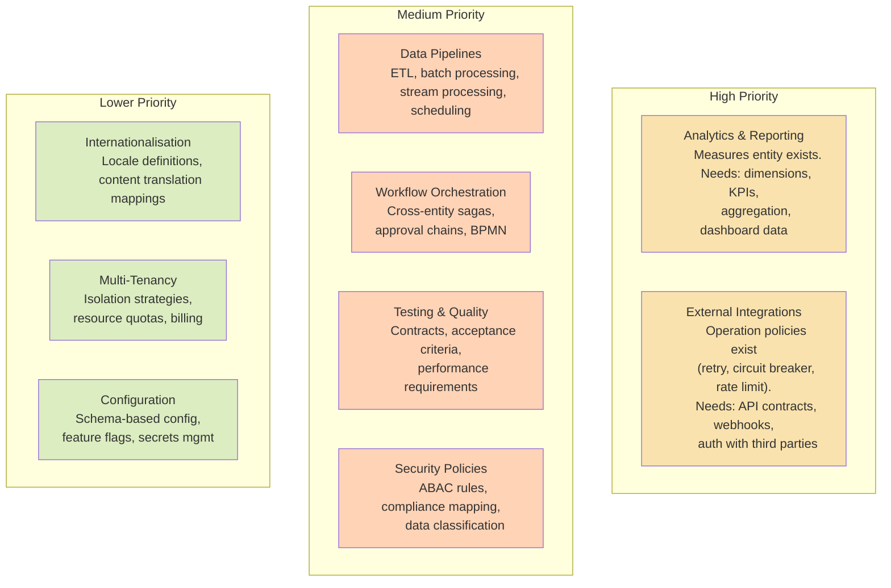

### The Analytics Gap (Partially Addressed)

The `measures` entity type now exists as an extension module, providing basic analytical primitives. But full analytics coverage needs more: dimensions, KPIs, aggregation expressions, and data source joins.

What's still needed - schema primitives for the full analytics pipeline:

```yaml
# What full analytics specs might look like in .specly
analytics:
  RevenueAnalysis:
    sources:
      - model: Order
        join: OrderItem on Order.id = OrderItem.orderId

    measures:
      totalRevenue:
        expression: SUM(OrderItem.price * OrderItem.quantity)
        format: currency
      averageOrderValue:
        expression: totalRevenue / COUNT(DISTINCT Order.id)

    dimensions:
      time: Order.createdAt granularity=[day, week, month, quarter]
      category: Product.category
      region: Order.shippingRegion

    kpis:
      monthlyTarget:
        measure: totalRevenue
        target: 100000
        alert: below_target for 2 consecutive periods
```

### The Integration Gap (Partially Addressed)

Operation policies (retry, circuit breaker, rate limit) now exist in the operations entity module. What's still needed: external API contracts, webhook definitions, third-party authentication flows, and connection pool management. The policy primitives provide a foundation; the external service definitions are the remaining work.

### The Pipeline Gap

Modern applications process data - ETL jobs, event stream processing, batch transformations, data quality checks. No .specly primitives exist yet for expressing data flow. This requires a new entity module with schema constructs for data sources, transformations, schedules, and quality gates.

### The Workflow Gap

Lifecycles are per-entity state machines. But real business processes span multiple entities - an order fulfillment saga touching inventory, payment, shipping, and notification services. SpecVerse needs cross-entity orchestration primitives: saga definitions, compensation handling, approval chains, and process-level state machines. The entity module architecture supports this - it's a matter of building the module.

---

## Appendix B: Component Status

### Maturity Overview

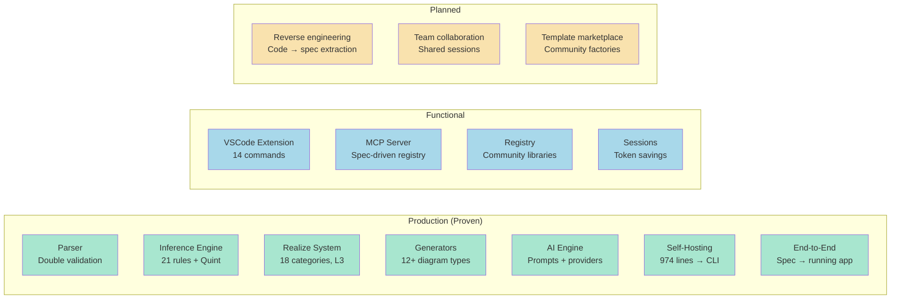

### Detailed Status Table

| Component | Status | Evidence |
|-----------|--------|---------|
| Parser + Schema | Production | Double validation, convention processing, 10 entity types |
| Inference Engine | Production | 21 rules, 4x-7.6x expansion, Quint transpiler |
| Realize System | Production | 18 factory categories, L1/L2/L3 generation |
| Generators | Production | 12+ diagram types, docs, UML |
| AI Engine | Production | Prompts, providers, orchestrator, sessions |
| Self-Hosting | Proven | 974-line spec generates 9-command CLI, used as release |
| End-to-End Pipeline | Proven | Spec to running app demonstrated (Fastify + Prisma + React) |
| Entity Module System | Production | 10 types, 9 facets, composition pipeline |
| Quint Guard Transpilation | Production | 117 guards, runtime enforcement |
| VSCode Extension | Functional | 14 commands, syntax highlighting, IntelliSense |
| MCP Server | Functional | Spec-driven tool registry |
| Registry Platform | Functional | Deployed, real libraries |
| Session Management | Functional | Claude Code integration, token savings |
| Code-to-Spec Extraction | Planned | Round-trip demonstrated in proof cycle |
| Team Collaboration | Not built | Shared sessions, merge workflows |
| Template Marketplace | Not built | Community-contributed instance factories |

---

## What's Next: ItsTimeToTrade

The self-hosting proof validates the pipeline on SpecVerse's own domain. The next milestone is **ItsTimeToTrade** - a real-world trading application built entirely from a .specly specification.

This tests what self-hosting cannot: a domain the system wasn't designed for. If the same pipeline that generates a specification language toolchain can also generate a trading platform - with its own models, lifecycles, business rules, and UI - then the "Define Once, Implement Anywhere" claim holds beyond the home domain.

ItsTimeToTrade is the first external proof point. The pipeline is ready. The spec is being written.