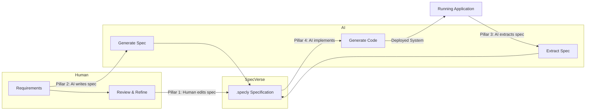
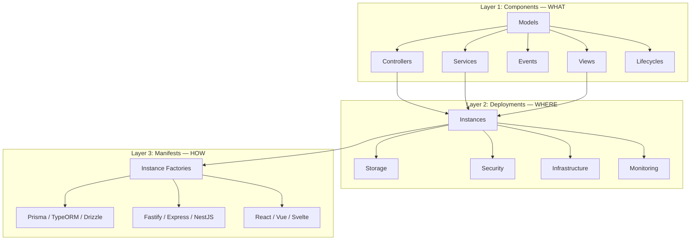
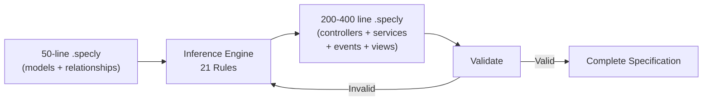
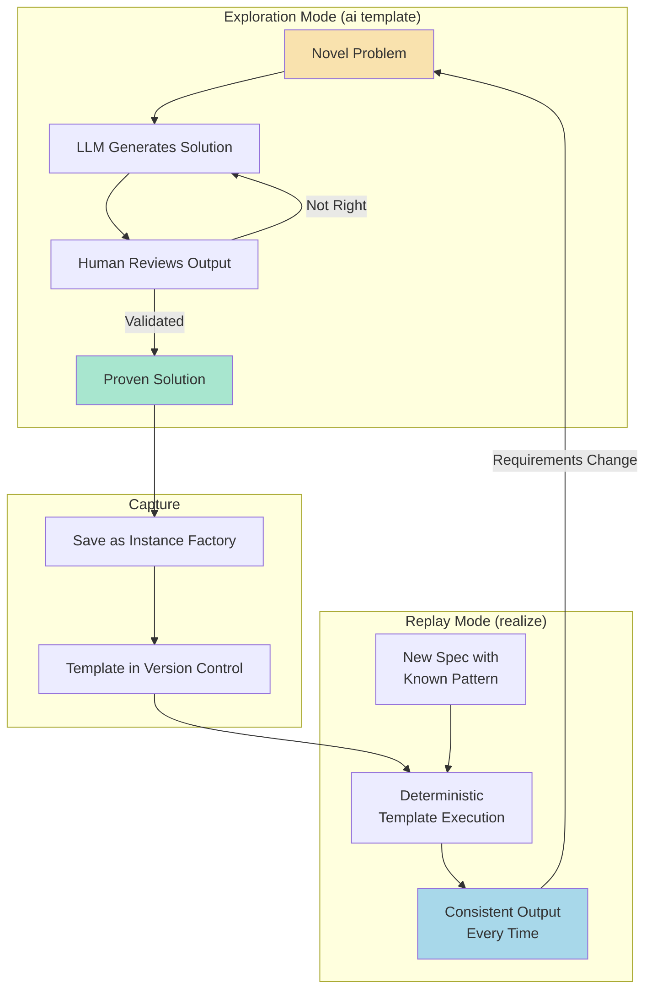
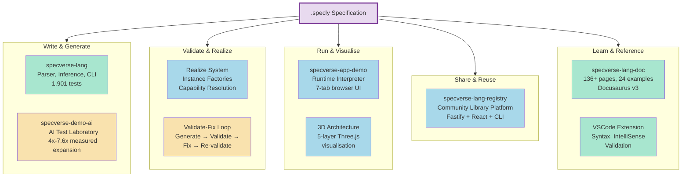
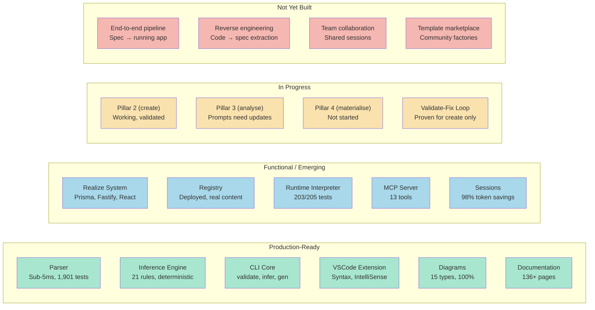
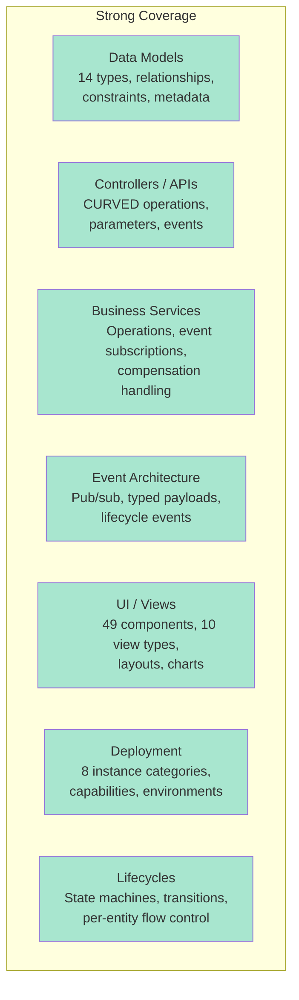
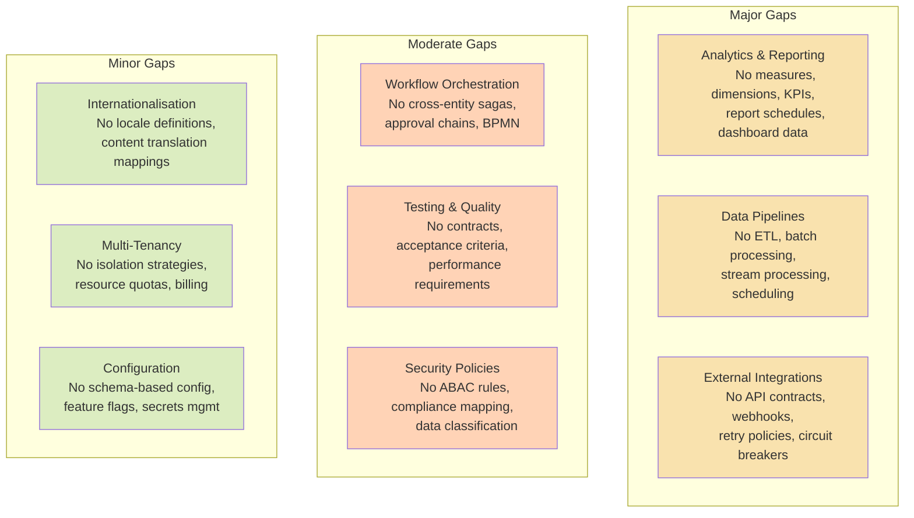
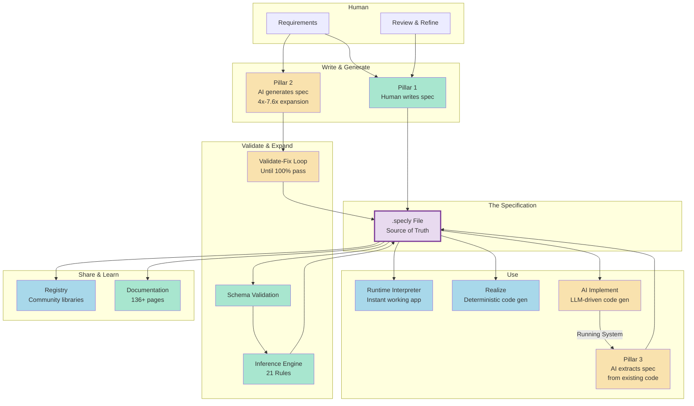

# SpecVerse: A Structured Language for Human-AI Software Collaboration

## The Core Idea

Software development is becoming a conversation between humans and AI. But conversations are messy. Requirements get lost. Intent gets misinterpreted. AI-generated code drifts from what was asked for. There's no shared format for expressing "what I want built" that both humans and machines can read, write, and reason about.

SpecVerse is that shared format.

It's a specification language - a structured way to describe software systems - designed from the ground up to sit at the interface between human intent and AI execution. Not a code generator. Not a framework. A **communication protocol** for software architecture.

```
Human Intent  ←→  SpecVerse (.specly)  ←→  AI Systems
```

A .specly file is readable by a developer, writable by an AI, extractable from existing code, and precise enough to generate implementations from. It captures the *what* and *why* of a system without dictating the *how*.

---

## Philosophy: The Four Pillars

SpecVerse is built on four capabilities that together create a complete human-AI development workflow:

### Pillar 1: Human-Writable

Developers write specifications naturally using YAML with convention shortcuts:

```yaml
models:
  User:
    attributes:
      email: Email required unique verified
      name: String required
      role: String default=member values=[member, admin, moderator]
    lifecycles:
      account:
        flow: pending -> active -> suspended -> deleted
```

No special tools required. Any developer who can read YAML can read and modify a .specly file. Conventions like `Email required unique verified` expand into structured schema definitions automatically.

### Pillar 2: AI-Writable (from Human Request)

An AI system receives a natural language request - "build me a property management system with bookings, guest profiles, and multi-property support" - and generates a complete, valid .specly specification. The specification is then validated against the SpecVerse schema, and any errors are automatically fixed through a validate-fix loop until the spec is 100% valid.

### Pillar 3: AI-Describable (from System Analysis)

An AI system examines an existing codebase - Express routes, database schemas, React components - and extracts a .specly specification describing what that system does. This creates an adoption path with zero risk: try SpecVerse on your existing code before committing to it.

### Pillar 4: AI-Implementable

A .specly specification is precise and structured enough that an AI system can generate a working implementation from it - database schemas, API routes, service logic, UI components - targeting whatever technology stack is specified.

### The Workflow

These four pillars combine into a continuous cycle:



The specification is always the source of truth. Humans and AI both read it, both write it, and the system stays in sync.

---

## How the Pieces Fit Together

### Three Architectural Layers

A SpecVerse specification describes a system at three levels of abstraction:



**Components** define models, business logic, events, and UI. **Deployments** map those components onto runtime infrastructure. **Manifests** bind abstract capabilities to concrete technologies via instance factories.

The same .specly specification can generate a Prisma + Fastify + React application or a TypeORM + NestJS + Vue application - the manifest controls the technology choices, not the spec.

### The Inference Engine

Between a minimal human specification and a complete architecture sits the inference engine: 21 deterministic rules that expand models into controllers, services, events, and views.



This isn't AI in the LLM sense - it's codified architectural knowledge. "Every model with a lifecycle gets an `evolve` operation." "Every `hasMany` relationship generates cascade delete handling." "Every model gets list, detail, and form views." The output is predictable, testable, and version-controlled.

---

## The Distillation Pattern: From AI Exploration to Deterministic Replay

This is SpecVerse's most distinctive architectural pattern, and it addresses a fundamental problem with AI-generated code: **repeatability**.

When an LLM generates a Prisma schema from a data model, it works. But ask it again tomorrow and you might get subtly different output. Ask it a hundred times and you've spent a hundred times the cost for inconsistent results.

SpecVerse solves this with a two-mode system:



**`ai template`** is for exploration. The LLM reasons about a problem, generates a solution, and you validate it. This costs tokens and takes seconds.

**`realize`** is for production. A proven solution is captured as an instance factory - a TypeScript template generator stored in version control. Execution is deterministic, takes milliseconds, costs nothing, and produces identical output every time.

**The lifecycle**: Solutions graduate from AI exploration to deterministic replay as they mature. When requirements change, they return to exploration mode, get re-validated, and are re-captured.

This means the instance factory templates in SpecVerse (Prisma schema generators, Fastify route generators, React hook generators) are themselves **distilled LLM knowledge** - the best solution an AI produced, validated by a human, crystallised for reliable reuse.

```
AI Exploration          Human Validation          Deterministic Replay
(creative, costly)  →   (quality gate)    →     (reliable, free)
                                                       │
                         Requirements Change ←─────────┘
```

---

## The Ecosystem

SpecVerse isn't just a language - it's a complete platform built around the .specly file as the central artifact. Every component in the ecosystem reads, writes, validates, interprets, or shares .specly specifications.



### specverse-lang — The Core Language

The heart of the ecosystem. Contains the parser, inference engine, CLI (30+ commands), code generation system, and all language definitions.

- **Parser**: Sub-5ms YAML + Conventions processing with JSON Schema validation. Conventions like `email: Email required unique verified` expand into structured type definitions automatically.
- **Inference Engine**: 21 deterministic rules that expand minimal models into complete architectures (controllers, services, events, views). Produces 4x-7.6x spec expansion depending on system complexity.
- **CLI**: 30+ commands spanning core operations (validate, infer, gen), code realisation (realize orm/services/routes), AI workflows (ai template analyse/create/materialise/realize), session management, and registry integration.
- **Realize System**: Manifest-driven code generation. Instance factories (Prisma, Fastify, React) are resolved via capability mapping, so the same spec generates different tech stacks by changing the manifest.
- **1,901 tests** across 5 tiers: parser, grammar, examples, inference, and CLI.

### specverse-app-demo — The Runtime Interpreter

A full-stack application that **executes .specly files at runtime without compilation**. Load a specification and instantly get a working application with REST API, WebSocket events, web UI, and in-memory database - all dynamically generated from the spec.

```
blog.specly → Parser → RuntimeEngine → Working Application
                                        ├── REST API (CURVED operations)
                                        ├── WebSocket (real-time events)
                                        ├── Web UI (7 tabs)
                                        ├── State Machines (lifecycles)
                                        └── In-Memory Database
```

**Seven browser tabs**: Models (CRUD interface with relationship dropdowns and lifecycle transitions), Views (custom dashboards and forms from spec), Events (live event stream), Diagrams (auto-generated Mermaid), 3D Graph (interactive Three.js architecture visualisation across 5 layers), Specly (live editor with hot reload), Help (built-in docs).

**Multi-server mode**: A manager UI (port 9000) orchestrates multiple spec servers simultaneously - upload .specly files through the browser, each runs on its own port.

This proves a key claim: a .specly specification is **precise enough to execute directly**. The spec isn't just a design document - it contains enough information to create a working application. This provides the fastest possible feedback loop: write spec → see running app → modify spec → hot reload.

**203/205 tests passing** (Vitest). Built with Express, React, Vite, Tailwind, React Query, and Three.js.

### specverse-demo-ai — The AI Testing Laboratory

A comprehensive test suite proving that SpecVerse's AI workflow actually works, with measurable quality metrics. Three generations of testing frameworks, culminating in an automated system that validates AI-generated specifications against hard benchmarks.

**Four test operations**, each mapping to a Four Pillars capability:

| Operation | Pillar | What It Tests | Result |
|-----------|--------|---------------|--------|
| demo-create | Pillar 2 | AI generates spec from simple requirements | 40 lines → 200 lines (4x) |
| pro-create | Pillar 2 | AI generates spec from enterprise requirements | 80 lines → 3,600+ lines (7.6x) |
| demo-analyse | Pillar 3 | AI extracts spec from clean codebase | In progress |
| pro-analyse | Pillar 3 | AI extracts spec from production code | In progress |

**The scale recognition story**: The same language format handles radically different scales. The AI inference engine doesn't just produce more lines at enterprise scale - it recognises the *kind* of system being described and generates architecturally appropriate patterns. Multi-tenancy appears only when multiple organisations are described. RBAC appears only when role hierarchies are specified. International support appears only when multiple countries are mentioned.

**The validate-fix loop**: Generate → validate against schema → fix errors automatically → re-validate until 100% pass. Combined with session caching (98% token savings, ~$0.40/generation), this makes AI-assisted specification development both reliable and economical.

**Test infrastructure**: Automated runners, prompt version comparison (v1 through v7+), metrics calculation (expansion ratio, benchmark compliance ±20% tolerance), HTML report generation. Uses native SpecVerse session management, down from 245 lines of custom bash to 3 wrapper scripts.

### specverse-lang-registry — The Community Library Platform

A production-deployed registry for sharing and discovering reusable .specly specifications. Think npm for specifications.

```yaml
# Use community libraries in your specs
import:
  - from: "@specverse/auth"
    select: [User, AuthController]
  - from: "@specverse/commerce"
    select: [Product, Order, OrderItem]
```

**Three components in a monorepo**:
- **API** (Fastify): 25+ endpoints, GitHub OAuth, server-side .specly validation, PostgreSQL/Prisma, download tracking, star system. Deployed on Vercel.
- **Web UI** (React + Vite): Browse libraries with tag/type/category filtering, publish with drag-and-drop upload, version history, README display.
- **CLI** (@specverse/reg on npm): 8 commands for login, publish, search, info, star/unstar. Device flow OAuth for terminal authentication.

**Integration with specverse-lang CLI**:
```bash
specverse lib search authentication       # Search by keyword
specverse lib search --tags auth,oauth    # Search by tags
specverse lib info @specverse/auth        # Get library details
specverse lib tags                        # Browse categories
```

Import resolution checks the registry before local files, caches results locally, and falls back gracefully when offline.

**Published libraries** include authentication patterns, e-commerce models, REST API conventions, event-driven architecture templates, and domain-specific models for company and retail commerce.

**Meta-story**: The registry itself was designed from a 719-line .specly specification (`spec/registry.specly`), serving as both the community hub and a real-world validation of specification-driven architecture.

### specverse-lang-doc — Documentation & Learning

136+ pages of Docusaurus v3 documentation covering the complete SpecVerse language, tooling, and ecosystem.

**Content**:
- **7 Getting Started pages**: Introduction, installation, quick start, architecture, AI integration, progressive examples, troubleshooting
- **18 Language Reference pages**: Complete syntax specification for every construct - models, controllers, services, events, views, imports, types, lifecycles, profiles, and the AI inference engine
- **60+ Example pages**: 24 core examples progressing from basic models to full enterprise architectures, each pairing a .specly source file with generated documentation. Categories span fundamentals, profiles, architecture, domains, meta-programming, deployment, legacy migration, and comprehensive reference.
- **6 Registry pages**: Platform overview, publishing workflow, discovery, CLI integration, API reference
- **15 Reference pages**: CLI reference, JSON schemas (29KB), glossary, build system, test framework
- **8 Tool pages**: Parser, validator, VSCode extension, language server, diagram generator, MCP server, runtime interpreter

**Automatic sync**: A 515-line script synchronises documentation from specverse-lang - examples, diagrams, metadata, sidebar configuration - ensuring docs stay current as the language evolves. CI/CD-safe with pre-generated fallbacks.

**Learning paths for different audiences**:

| Audience | Entry Point | Time |
|----------|------------|------|
| Beginner | Introduction → Quick Start → Fundamentals examples | 2-3 hours |
| Developer | Quick Start → Architecture → Services & Events | 1-2 hours |
| Architect | Introduction → Component Architecture → Advanced examples | 1-2 hours |
| DevOps | Deployment docs → Deployment examples → Registry | 1 hour |

---

## Current State of the Tooling

### Maturity Overview



### Detailed Status

| Component | Maturity | Evidence |
|-----------|----------|---------|
| Parser + Schema | Production | Sub-5ms, 1,901 tests, convention processing |
| Inference Engine | Production | 21 rules, 4x-7.6x expansion, deterministic |
| CLI (core commands) | Production | validate, infer, gen, init, migrate |
| VSCode Extension | Production | Syntax, IntelliSense, validation, diagram preview |
| Diagram Generator | Production | 15 Mermaid types, 100% complete |
| Documentation Site | Production | 136+ pages, auto-sync, Docusaurus v3 |
| TypeScript API | Production | Programmatic access, verified examples |
| Realize System | Functional | Instance factories for Prisma, Fastify, React |
| Registry Platform | Functional | Deployed on Vercel, real libraries, 49 API tests |
| Runtime Interpreter | Functional | 7-tab UI, multi-server, 203/205 tests |
| MCP Server | Functional | 7 core + 6 orchestrator tools |
| Session Management | Functional | Claude Code integration, 98% token savings |
| AI Create (Pillar 2) | Validated | 4x-7.6x measured, validate-fix loop working |
| AI Analyse (Pillar 3) | Early | Prompts exist, need updating |
| AI Materialise/Realize (Pillar 4) | Not started | Framework and infrastructure ready |
| End-to-end pipeline | Not built | No spec → running app single command |
| Code → spec extraction | Not built | Cannot reverse-engineer existing systems |

---

## Language Coverage: What .specly Can and Cannot Express

### Strong Coverage (Production-Ready)

These domains have well-defined schema primitives, inference rules, and tooling support:



**What this enables**: SaaS applications, CRUD-heavy systems, booking platforms, CMS platforms, project management tools, e-commerce storefronts - any system primarily concerned with entities, their lifecycles, and CRUD operations.

### Gaps: What's Missing from a Complete Specification Language



#### The Analytics Gap (Most Significant)

Every business application needs reporting. SpecVerse can describe a `dashboard` view with `chart` components, but it's a UI description with no data semantics. You can say "put a bar chart here" but you can't say:

> "This chart shows monthly revenue by product category, filtered by region, with a target line at $100K and an alert when it drops below for 2 consecutive months."

What's needed:

```yaml
# What analytics specs might look like in .specly
analytics:
  RevenueAnalysis:
    sources:
      - model: Order
        join: OrderItem on Order.id = OrderItem.orderId

    measures:
      totalRevenue:
        expression: SUM(OrderItem.price * OrderItem.quantity)
        format: currency
      averageOrderValue:
        expression: totalRevenue / COUNT(DISTINCT Order.id)

    dimensions:
      time: Order.createdAt granularity=[day, week, month, quarter]
      category: Product.category
      region: Order.shippingRegion

    kpis:
      monthlyTarget:
        measure: totalRevenue
        target: 100000
        alert: below_target for 2 consecutive periods
```

#### The Pipeline Gap

Modern applications process data - ETL jobs, event stream processing, batch transformations, data quality checks. No .specly primitives exist for expressing data flow.

#### The Integration Gap

SpecVerse describes internal services well but has no way to specify how your system talks to the outside world - external API contracts, webhook handling, retry policies, circuit breakers, authentication with third-party services.

#### The Workflow Gap

Lifecycles are per-entity state machines. But real business processes span multiple entities - an order fulfillment saga touching inventory, payment, shipping, and notification services. SpecVerse has no cross-entity orchestration primitives.

### Coverage Summary

| Specification Domain | Coverage | Priority to Add |
|---------------------|----------|-----------------|
| Data Models & Relationships | Complete | - |
| Controllers / CRUD APIs | Complete | - |
| Business Services & Events | Complete | - |
| UI Views & Components | Complete | - |
| Lifecycle State Machines | Complete | - |
| Deployment Infrastructure | Complete | - |
| **Analytics & Reporting** | **None** | **High** |
| **Data Pipelines** | **None** | **Medium** |
| **External Integrations** | **None** | **High** |
| **Workflow Orchestration** | **None** | **Medium** |
| Testing & Quality Contracts | None | Medium |
| Security Policies (ABAC) | Minimal | Medium |
| Internationalisation | None | Low |
| Multi-Tenancy (explicit) | Minimal | Low |
| Configuration Management | Minimal | Low |

The language is excellent for its core domain (CRUD/SaaS applications). The path to a universal specification language requires incremental expansion, starting with analytics and integrations - the two gaps most commonly encountered in real-world applications.

---

## What Makes This Different

There are many specification languages (OpenAPI, AsyncAPI, Terraform, Pulumi) and many AI coding tools (Cursor, Copilot, Windsurf). SpecVerse occupies a different space:

**It's not a code generator.** It's a format for expressing software architecture that happens to be implementable. The specification is the artifact, not the generated code. The runtime interpreter proves this: load a .specly file and get a running application without generating a single line of code.

**It's not an API spec.** OpenAPI describes HTTP endpoints. SpecVerse describes entire systems - models, business logic, events, UI, deployment, and the relationships between them.

**It's not an IaC tool.** Terraform describes infrastructure. SpecVerse describes applications and maps them onto infrastructure through its deployment and manifest layers.

**It's not a solo tool.** The registry enables community sharing of proven specification patterns. Import authentication, e-commerce, or domain models instead of writing them from scratch.

**It's a human-AI interface.** The specification format is designed so that humans can write it (Pillar 1), AI can generate it (Pillar 2), AI can extract it from existing systems (Pillar 3), and AI can implement from it (Pillar 4). No other tool is designed for all four.

The bet is that as AI becomes central to software development, the bottleneck shifts from "writing code" to "communicating intent precisely." SpecVerse is purpose-built for that world.

---

## The Full Picture



Everything revolves around the .specly file. It's written by humans and AI. It's validated, expanded, and inferred. It's executed at runtime, realised into code, and shared through the registry. It's documented, visualised in 3D, and extracted from existing systems.

One file format. One source of truth. Readable by humans. Writable by machines. That's the idea.
