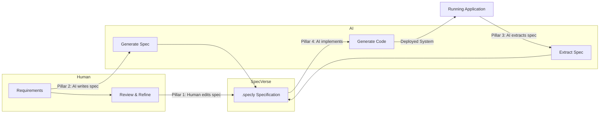
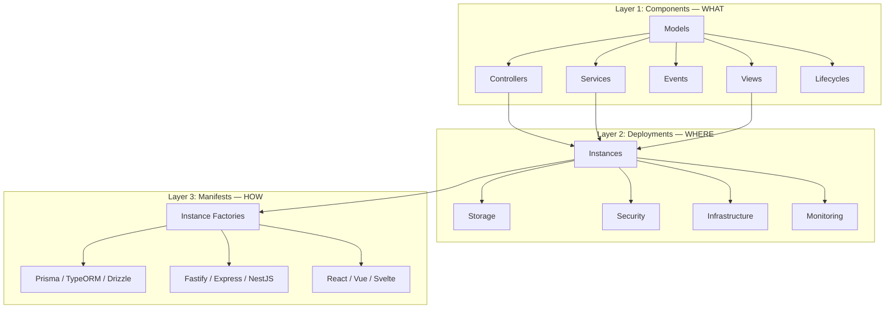
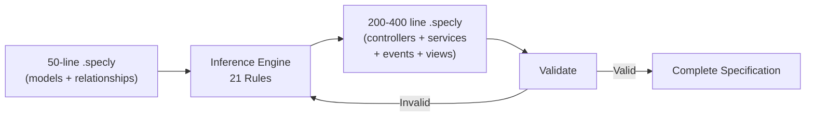
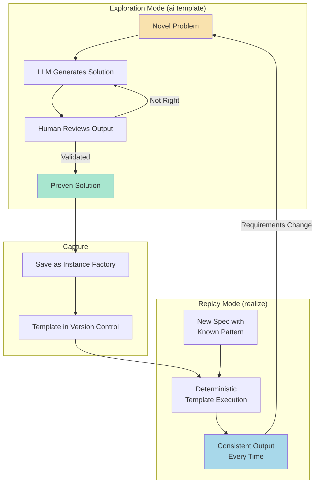
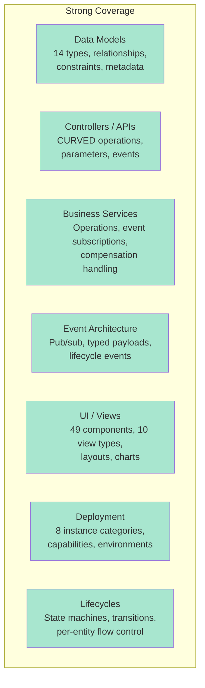
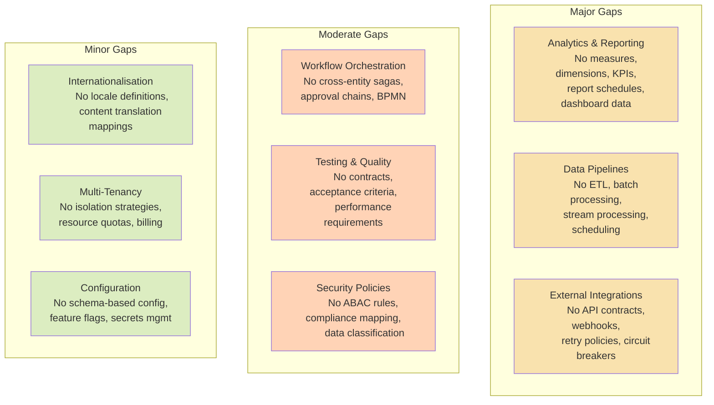
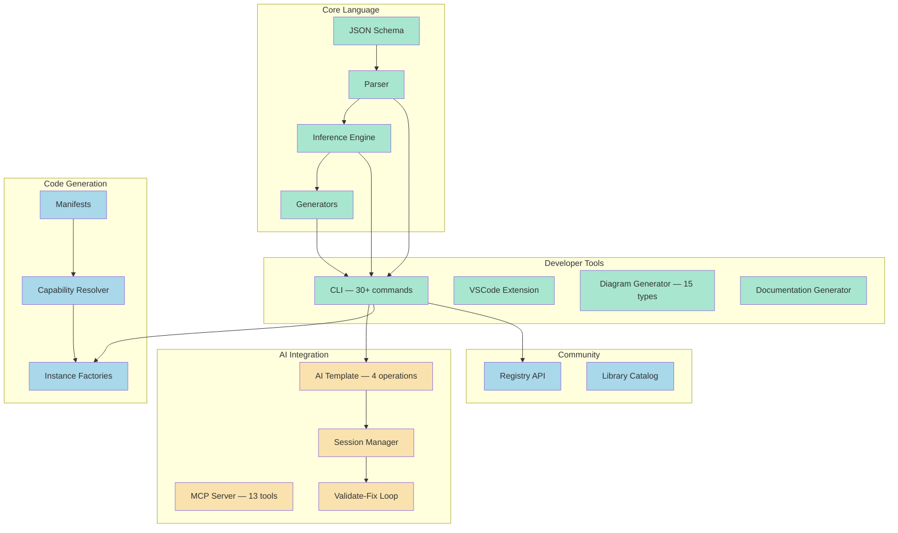

# SpecVerse: A Structured Language for Human-AI Software Collaboration

## The Core Idea

Software development is becoming a conversation between humans and AI. But conversations are messy. Requirements get lost. Intent gets misinterpreted. AI-generated code drifts from what was asked for. There's no shared format for expressing "what I want built" that both humans and machines can read, write, and reason about.

SpecVerse is that shared format.

It's a specification language - a structured way to describe software systems - designed from the ground up to sit at the interface between human intent and AI execution. Not a code generator. Not a framework. A **communication protocol** for software architecture.

```
Human Intent  ←→  SpecVerse (.specly)  ←→  AI Systems
```

A .specly file is readable by a developer, writable by an AI, extractable from existing code, and precise enough to generate implementations from. It captures the *what* and *why* of a system without dictating the *how*.

---

## Philosophy: The Four Pillars

SpecVerse is built on four capabilities that together create a complete human-AI development workflow:

### Pillar 1: Human-Writable

Developers write specifications naturally using YAML with convention shortcuts:

```yaml
models:
  User:
    attributes:
      email: Email required unique verified
      name: String required
      role: String default=member values=[member, admin, moderator]
    lifecycles:
      account:
        flow: pending -> active -> suspended -> deleted
```

No special tools required. Any developer who can read YAML can read and modify a .specly file. Conventions like `Email required unique verified` expand into structured schema definitions automatically.

### Pillar 2: AI-Writable (from Human Request)

An AI system receives a natural language request - "build me a property management system with bookings, guest profiles, and multi-property support" - and generates a complete, valid .specly specification. The specification is then validated against the SpecVerse schema, and any errors are automatically fixed through a validate-fix loop until the spec is 100% valid.

### Pillar 3: AI-Describable (from System Analysis)

An AI system examines an existing codebase - Express routes, database schemas, React components - and extracts a .specly specification describing what that system does. This creates an adoption path with zero risk: try SpecVerse on your existing code before committing to it.

### Pillar 4: AI-Implementable

A .specly specification is precise and structured enough that an AI system can generate a working implementation from it - database schemas, API routes, service logic, UI components - targeting whatever technology stack is specified.

### The Workflow

These four pillars combine into a continuous cycle:



The specification is always the source of truth. Humans and AI both read it, both write it, and the system stays in sync.

---

## How the Pieces Fit Together

### Three Architectural Layers

A SpecVerse specification describes a system at three levels of abstraction:



**Components** define models, business logic, events, and UI. **Deployments** map those components onto runtime infrastructure. **Manifests** bind abstract capabilities to concrete technologies via instance factories.

The same .specly specification can generate a Prisma + Fastify + React application or a TypeORM + NestJS + Vue application - the manifest controls the technology choices, not the spec.

### The Inference Engine

Between a minimal human specification and a complete architecture sits the inference engine: 21 deterministic rules that expand models into controllers, services, events, and views.



This isn't AI in the LLM sense - it's codified architectural knowledge. "Every model with a lifecycle gets an `evolve` operation." "Every `hasMany` relationship generates cascade delete handling." "Every model gets list, detail, and form views." The output is predictable, testable, and version-controlled.

---

## The Distillation Pattern: From AI Exploration to Deterministic Replay

This is SpecVerse's most distinctive architectural pattern, and it addresses a fundamental problem with AI-generated code: **repeatability**.

When an LLM generates a Prisma schema from a data model, it works. But ask it again tomorrow and you might get subtly different output. Ask it a hundred times and you've spent a hundred times the cost for inconsistent results.

SpecVerse solves this with a two-mode system:



**`ai template`** is for exploration. The LLM reasons about a problem, generates a solution, and you validate it. This costs tokens and takes seconds.

**`realize`** is for production. A proven solution is captured as an instance factory - a TypeScript template generator stored in version control. Execution is deterministic, takes milliseconds, costs nothing, and produces identical output every time.

**The lifecycle**: Solutions graduate from AI exploration to deterministic replay as they mature. When requirements change, they return to exploration mode, get re-validated, and are re-captured.

This means the instance factory templates in SpecVerse (Prisma schema generators, Fastify route generators, React hook generators) are themselves **distilled LLM knowledge** - the best solution an AI produced, validated by a human, crystallised for reliable reuse.

```
AI Exploration          Human Validation          Deterministic Replay
(creative, costly)  →   (quality gate)    →     (reliable, free)
                                                       │
                         Requirements Change ←─────────┘
```

---

## Current State of the Tooling

### What's Production-Ready

| Component | Status | Details |
|-----------|--------|---------|
| **Parser** | Mature | Sub-5ms, 1,901 tests passing, convention processing |
| **JSON Schema** | Mature | Complete validation for all .specly constructs |
| **Inference Engine** | Mature | 21 rules, 4x-7.6x expansion, deterministic |
| **CLI (core)** | Mature | validate, infer, gen, init, migrate commands |
| **VSCode Extension** | Mature | Syntax highlighting, IntelliSense, validation |
| **Diagram Generator** | Mature | 15 Mermaid diagram types, 100% complete |
| **Documentation Generator** | Mature | Auto-generated from specs |
| **TypeScript API** | Mature | Programmatic access, verified examples |

### What's Emerging

| Component | Status | Details |
|-----------|--------|---------|
| **Realize System** | Functional | Instance factories for Prisma, Fastify, React; capability resolution working |
| **Registry** | Functional | API deployed, CLI integration working, needs community content |
| **MCP Server** | Functional | 7 core tools + 6 orchestrator tools, multi-environment |
| **Session Management** | Functional | Filesystem-based, Claude Code integration, 98% token savings via caching |

### What's In Progress

| Component | Status | Details |
|-----------|--------|---------|
| **Pillar 2 (AI-Writable)** | Partial | `create` operation working with validate-fix loop; `materialise` and `realize` prompts incomplete |
| **Pillar 3 (AI-Describable)** | Early | `analyse` prompt exists but marked as needing updates |
| **Pillar 4 (AI-Implementable)** | Partial | Works through `realize` for known patterns; AI path needs completion |
| **AI Template System** | Partial | Four operations defined; only `create` fully validated |
| **Validate-Fix Loop** | Partial | Proven for spec creation; needs extension to all four operations |

### What Doesn't Exist Yet

| Component | Notes |
|-----------|-------|
| **End-to-end pipeline** | No single command from .specly to running application |
| **Reverse engineering** | Cannot point at existing code and extract a spec |
| **Team collaboration** | Session management is single-developer, filesystem-only |
| **Template marketplace** | Instance factories are bundled, not community-contributed |

---

## Language Coverage: What .specly Can and Cannot Express

### Strong Coverage (Production-Ready)

These domains have well-defined schema primitives, inference rules, and tooling support:



**What this enables**: SaaS applications, CRUD-heavy systems, booking platforms, CMS platforms, project management tools, e-commerce storefronts - any system primarily concerned with entities, their lifecycles, and CRUD operations.

### Gaps: What's Missing from a Complete Specification Language



#### The Analytics Gap (Most Significant)

Every business application needs reporting. SpecVerse can describe a `dashboard` view with `chart` components, but it's a UI description with no data semantics. You can say "put a bar chart here" but you can't say:

> "This chart shows monthly revenue by product category, filtered by region, with a target line at $100K and an alert when it drops below for 2 consecutive months."

What's needed:

```yaml
# What analytics specs might look like in .specly
analytics:
  RevenueAnalysis:
    sources:
      - model: Order
        join: OrderItem on Order.id = OrderItem.orderId

    measures:
      totalRevenue:
        expression: SUM(OrderItem.price * OrderItem.quantity)
        format: currency
      averageOrderValue:
        expression: totalRevenue / COUNT(DISTINCT Order.id)

    dimensions:
      time: Order.createdAt granularity=[day, week, month, quarter]
      category: Product.category
      region: Order.shippingRegion

    kpis:
      monthlyTarget:
        measure: totalRevenue
        target: 100000
        alert: below_target for 2 consecutive periods
```

#### The Pipeline Gap

Modern applications process data - ETL jobs, event stream processing, batch transformations, data quality checks. No .specly primitives exist for expressing data flow.

#### The Integration Gap

SpecVerse describes internal services well but has no way to specify how your system talks to the outside world - external API contracts, webhook handling, retry policies, circuit breakers, authentication with third-party services.

#### The Workflow Gap

Lifecycles are per-entity state machines. But real business processes span multiple entities - an order fulfillment saga touching inventory, payment, shipping, and notification services. SpecVerse has no cross-entity orchestration primitives.

### Coverage Summary

| Specification Domain | Coverage | Priority to Add |
|---------------------|----------|-----------------|
| Data Models & Relationships | Complete | - |
| Controllers / CRUD APIs | Complete | - |
| Business Services & Events | Complete | - |
| UI Views & Components | Complete | - |
| Lifecycle State Machines | Complete | - |
| Deployment Infrastructure | Complete | - |
| **Analytics & Reporting** | **None** | **High** |
| **Data Pipelines** | **None** | **Medium** |
| **External Integrations** | **None** | **High** |
| **Workflow Orchestration** | **None** | **Medium** |
| Testing & Quality Contracts | None | Medium |
| Security Policies (ABAC) | Minimal | Medium |
| Internationalisation | None | Low |
| Multi-Tenancy (explicit) | Minimal | Low |
| Configuration Management | Minimal | Low |

The language is excellent for its core domain (CRUD/SaaS applications). The path to a universal specification language requires incremental expansion, starting with analytics and integrations - the two gaps most commonly encountered in real-world applications.

---

## The Ecosystem at a Glance



**Green** = Production-ready | **Blue** = Functional / Emerging | **Yellow** = In Progress

---

## What Makes This Different

There are many specification languages (OpenAPI, AsyncAPI, Terraform, Pulumi) and many AI coding tools (Cursor, Copilot, Windsurf). SpecVerse occupies a different space:

**It's not a code generator.** It's a format for expressing software architecture that happens to be implementable. The specification is the artifact, not the generated code.

**It's not an API spec.** OpenAPI describes HTTP endpoints. SpecVerse describes entire systems - models, business logic, events, UI, deployment, and the relationships between them.

**It's not an IaC tool.** Terraform describes infrastructure. SpecVerse describes applications and maps them onto infrastructure through its deployment and manifest layers.

**It's a human-AI interface.** The specification format is designed so that humans can write it (Pillar 1), AI can generate it (Pillar 2), AI can extract it from existing systems (Pillar 3), and AI can implement from it (Pillar 4). No other tool is designed for all four.

The bet is that as AI becomes central to software development, the bottleneck shifts from "writing code" to "communicating intent precisely." SpecVerse is purpose-built for that world.
