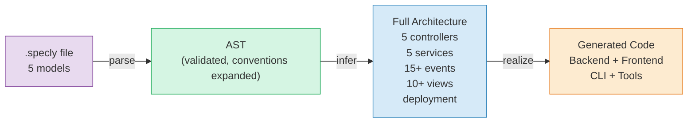
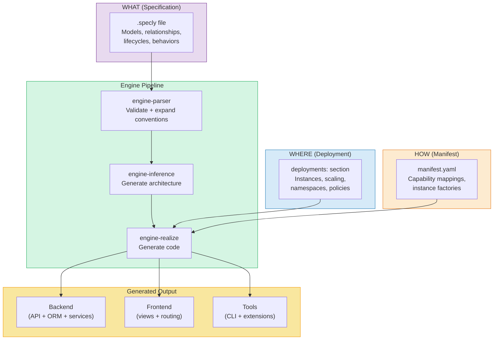
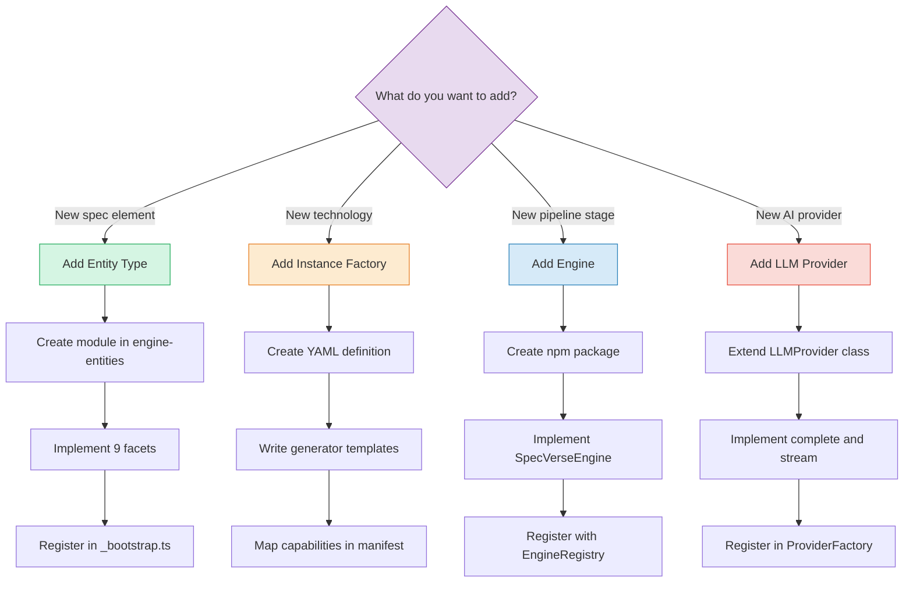

# The SpecVerse Guide

A complete guide to writing `.specly` specifications, using the toolchain, and extending the system.

For the philosophy and motivation behind SpecVerse, see [SPECVERSE-INTRODUCTION-V4.md](Entity-Module-Intro/SPECVERSE-INTRODUCTION-V4.md).

---

## Contents

### Part 1: Writing Specifications
- [Your First Spec](#your-first-spec) — a minimal working example
- [Models](#models) — attributes, metadata, profiles, convention shorthand
- [Relationships](#relationships) — hasMany, belongsTo, hasOne, manyToMany
- [Lifecycles](#lifecycles) — state machines on models
- [Behaviors](#behaviors) — declarative business logic with contracts
- [Controllers](#controllers) — API endpoints and CURVED operations
- [Services](#services) — cross-model business logic
- [Events](#events) — domain events with typed payloads
- [The Event System](#the-event-system) — publish, subscribe, and event-driven architecture
- [Views](#views) — UI specifications
- [Deployments](#deployments) — runtime topology, operation policies, autoscaling, namespaces
- [Primitives](#primitives) — custom type definitions
- [Commands](#commands-extension-entity) — CLI generation from spec
- [Measures](#measures-extension-entity) — aggregation metrics
- [Conventions](#conventions-extension-entity) — meta-circular shorthand definitions
- [Promotions](#promotions-extension-entity) — domain extension example
- [How Behaviors Become Code](#how-behaviors-become-code) — L1/L2/L3 generation
- [How Inference Works](#how-inference-works) — what rules generate what
- [Imports and Exports](#imports-and-exports) — sharing between specs

### Part 2: The Toolchain
- [Pipeline](#pipeline) — parse → infer → realize
- [CLI Commands](#cli-commands) — the full command reference
- [Manifests](#manifests) — mapping WHAT to HOW
- [Generated Output](#generated-output) — what you get

### Part 3: Extending SpecVerse
- [Engines vs Entity Modules vs Factories](#understanding-engines-vs-entity-modules-vs-instance-factories) — when to use which
- [Adding a New Entity Type](#adding-a-new-entity-type) — the 9-facet module system
- [Adding a New Instance Factory](#adding-a-new-instance-factory) — code generation templates
- [Adding a New LLM Provider](#adding-a-new-llm-provider) — pluggable AI execution
- [Formal Verification with Quint](#formal-verification-with-quint) — invariants and rules
- [Behavioural Conventions](#behavioural-conventions) — human-readable patterns

### Part 4: Architecture
- [Engine Packages](#engine-packages) — the 7 npm packages
- [Instance Factory Catalog](#instance-factory-catalog) — the complete list of code generators
- [Entity Module System](#entity-module-system) — composable 9-facet modules
- [Separation of Concerns](#separation-of-concerns) — WHAT / WHERE / HOW
- [Quick Reference](#quick-reference) — cheat sheets

---

## Part 1: Writing Specifications

### Your First Spec

A `.specly` file defines WHAT your system does, not HOW it's built:

```yaml
components:
  TaskManager:
    version: "1.0.0"
    description: "A simple task management system"

    models:
      Task:
        attributes:
          id: UUID required unique
          title: String required
          description: String
          priority: String values=[low,medium,high] default=medium
          dueDate: DateTime
        lifecycles:
          status:
            flow: todo -> in_progress -> done
```

That's a complete, valid spec. The inference engine generates the rest — controllers, services, events, views — from this minimal definition.



### Models

Models are the foundation. Everything else is derived from them.

**Attributes** use convention shorthand — type followed by modifiers:

```yaml
attributes:
  id: UUID required unique           # Type + boolean modifiers
  email: Email required unique        # Built-in Email type
  price: Money min=0 default=9.99    # Key=value modifiers
  status: String values=[a,b,c]      # Enum values
  tags: String[]                      # Array type
```

Available types: `String`, `Integer`, `Number`, `Boolean`, `UUID`, `DateTime`, `Date`, `Email`, `URL`, `Money`, `JSON`

Available modifiers: `required`, `optional`, `unique`, `searchable`, `verified`, `default=`, `min=`, `max=`, `values=[]`, `auto=`

**Metadata** generates synthetic fields automatically:

```yaml
models:
  Post:
    metadata:
      id: uuid              # Generates UUID id field
      audit: true            # Generates createdAt, updatedAt
      softDelete: true       # Generates deletedAt, isDeleted
      status: publishing     # Derives from lifecycle name
      version: true          # Generates version field for optimistic locking
      label: [title]         # Display label field(s)
```

### Relationships

**Profiles** attach reusable configuration to models. Define a model as a profile with `profile-attachment`:

```yaml
models:
  Product:
    attributes:
      id: UUID required unique
      name: String required
      price: Money required

  DigitalProductProfile:
    description: "Profile for digital products"
    attributes:
      downloadUrl: String required
      fileSize: String
      license: String required
    profile-attachment:
      profiles: [Product]         # This profile attaches to Product
```

Profiles let you compose model capabilities without deep inheritance. A `Product` can have both a `DigitalProductProfile` and a `PhysicalProductProfile` attached.

### Relationships

```yaml
relationships:
  orders: hasMany Order cascade       # One-to-many, cascade delete
  customer: belongsTo Customer        # Many-to-one (FK on this model)
  profile: hasOne Profile             # One-to-one
  tags: manyToMany Tag through=PostTag  # Many-to-many via junction
```

Four types: `hasMany`, `belongsTo`, `hasOne`, `manyToMany`

Modifiers: `cascade`, `dependent`, `eager`, `lazy`, `optional`, `through=`

### Lifecycles

State machines on models. The shorthand syntax:

```yaml
lifecycles:
  order:
    flow: draft -> submitted -> confirmed -> shipped -> delivered
```

This generates states, transitions, and the `evolve` operation for state changes.

### Behaviors

Declarative business logic with contracts:

```yaml
behaviors:
  calculateTotal:
    description: "Calculate order total from line items"
    parameters:
      discountRate: Number min=0 max=1
    returns: Money
    requires: ["Order has at least one item", "discountRate is valid"]
    ensures: ["Total reflects all items minus discount"]
    publishes: [OrderTotalCalculated]

  processPayment:
    parameters:
      paymentMethod: String required values=[card,bank,crypto]
      amount: Money required
    requires: ["Amount matches order total", "Payment method is valid"]
    ensures: ["Payment recorded", "Order status updated"]
    publishes: [PaymentProcessed]
    steps:
      - "Validate payment details"
      - "Charge payment provider"
      - "Record transaction"
      - "Update order status"
```

- `requires` — preconditions (must be true before execution)
- `ensures` — postconditions (guaranteed after execution)
- `publishes` — domain events emitted on success
- `steps` — ordered execution steps for complex workflows

### Controllers

Define API endpoints. Usually inferred from models, but can be explicit:

```yaml
controllers:
  ProductController:
    model: Product
    description: "Product management API"
    actions:
      restock:
        parameters:
          quantity: Integer required min=1
        returns: Product
        requires: ["Product exists"]
        ensures: ["Stock increased by quantity"]
        publishes: [ProductRestocked]
```

The inference engine generates standard CURVED operations automatically:
- **C**reate — `POST /api/products`
- **U**pdate — `PATCH /api/products/:id`
- **R**etrieve — `GET /api/products/:id` and `GET /api/products`
- **V**alidate — business rule checking
- **E**volve — lifecycle state transitions
- **D**elete — `DELETE /api/products/:id`

### Services

Business logic that spans multiple models:

```yaml
services:
  OrderFulfillmentService:
    description: "Coordinates order processing across models"
    operations:
      fulfillOrder:
        parameters:
          orderId: UUID required
        returns: Boolean
        requires: ["Order exists and is confirmed"]
        ensures: ["Inventory reserved", "Shipping label created"]
        publishes: [OrderFulfilled]
```

### Events

Domain events with typed payloads:

```yaml
events:
  OrderPlaced:
    description: "Customer placed a new order"
    attributes:
      orderId: UUID required
      customerId: UUID required
      total: Money required
      itemCount: Integer required
```

Events are usually inferred from model behaviors and controller actions. Define them explicitly when you need custom payload shapes.

### The Event System

Events connect the components of your system. The pattern is **publish/subscribe** — behaviors and controllers publish events, services subscribe to handle them.

**Publishing** — declare what events an operation emits:

```yaml
# In a controller action or service operation:
behaviors:
  confirmOrder:
    requires: ["Order is pending", "Payment verified"]
    ensures: ["Order confirmed"]
    publishes: [OrderConfirmed, InventoryReservationRequested]
```

**Subscribing** — services declare which events they handle using `subscribes_to`:

```yaml
services:
  InventoryService:
    description: "Manages stock levels"
    subscribes_to:
      InventoryReservationRequested: reserveStock
      OrderCancelled: releaseStock
    operations:
      reserveStock:
        parameters:
          orderId: UUID required
          items: Array required
        ensures: ["Stock reserved for all items"]
        publishes: [StockReserved]
      releaseStock:
        parameters:
          orderId: UUID required
        ensures: ["Reserved stock released"]
        publishes: [StockReleased]
```

**Event chains** — events triggering further events creates reactive workflows:

```
Customer places order
  → OrderPlaced event
    → PaymentService.processPayment subscribes
      → PaymentProcessed event
        → OrderService.confirmOrder subscribes
          → OrderConfirmed event
            → InventoryService.reserveStock subscribes
              → StockReserved event
                → NotificationService.sendConfirmation subscribes
```

The inference engine generates this event wiring automatically from your model relationships and behaviors. The realize engine produces the EventEmitter bus (development) or can target RabbitMQ (production) via different instance factories.

**What gets generated:**
- Event type definitions with typed payloads
- Publisher methods on controllers and services
- Subscriber registration on service initialization
- Event bus infrastructure (EventEmitter or message queue)

### Views

UI specifications:

```yaml
views:
  ProductCatalog:
    description: "Product browsing and search"
    model: Product
    type: list

  ProductDetail:
    description: "Single product view"
    model: Product
    type: detail

  OrderDashboard:
    description: "Order management dashboard"
    type: dashboard
```

View types: `list`, `detail`, `form`, `dashboard`, `page`, `custom`

The realize engine generates React components from view specs — list views with sortable columns, detail views with attribute grids, form views with typed inputs and FK dropdowns.

### Deployments

Bridge the logical specification to the physical infrastructure:

```yaml
deployments:
  development:
    version: "1.0.0"
    environment: development
    instances:
      storage:
        mainDb:
          component: MyApp
          type: relational
          provider: sqlite
          persistence: durable
```

Instance types: `controllers`, `services`, `views`, `communications`, `storage`, `security`, `infrastructure`, `monitoring`

**Operation policies** — apply resilience patterns to specific operations:

```yaml
deployments:
  production:
    instances:
      controllers:
        api:
          component: MyApp
          operationPolicies:
            processPayment:
              retry:
                enabled: true
                maxAttempts: 3
                backoffMs: 100
                retryableErrors: ["TIMEOUT", "UNAVAILABLE"]
              circuitBreaker:
                enabled: true
                failureThreshold: 5
                halfOpenAfterMs: 60000
            listProducts:
              rateLimit:
                enabled: true
                requestsPerMinute: 1000
                burstSize: 100
                byIP: true
              cache:
                enabled: true
                ttlSeconds: 300
                keyFields: ["category", "limit", "offset"]
```

Available policies: `retry`, `circuitBreaker`, `rateLimit`, `cache`, `transactional`, `idempotency`

**Autoscaling and resources** — production deployment configuration:

```yaml
deployments:
  production:
    instances:
      controllers:
        api:
          component: MyApp
          scale: 3
          resources:
            requests:
              cpu: "100m"
              memory: "128Mi"
            limits:
              cpu: "500m"
              memory: "512Mi"
          autoscaling:
            enabled: true
            minReplicas: 2
            maxReplicas: 10
            targetCPU: 80
```

**Namespace configuration** — domain isolation:

```yaml
deployments:
  production:
    namespacing:
      strategy: "domain-based"
      namespaces:
        products:
          isolation: "strict"
          resourceLimits:
            cpu: "1000m"
            memory: "2Gi"
        orders:
          isolation: "permissive"
      crossNamespacePolicy: "explicit"
```

Strategies: `single`, `domain-based`, `environment-based`, `tenant-based`

### Commands (Extension Entity)

Define CLI commands directly in your spec. The realize engine generates a full Commander.js CLI:

```yaml
components:
  CLI:
    commands:
      mytool:
        description: "My application CLI"
        subcommands:
          deploy:
            description: "Deploy the application"
            arguments:
              environment:
                type: String
                required: true
                positional: true
            flags:
              --dry-run:
                type: Boolean
                default: false
                description: "Preview without executing"
              --region:
                type: String
                alias: "-r"
                default: "us-east-1"
                description: "AWS region"
            returns: DeploymentResult
            exitCodes:
              0: Success
              1: Deployment failed
```

This generates:
- CLI entry point with Commander.js
- Typed argument and flag parsing
- Subcommand registration
- Help text from descriptions

### Measures (Extension Entity)

Define analytics and aggregation metrics:

```yaml
measures:
  totalRevenue:
    source: Order
    aggregation: sum
    field: total
    filter: "status = 'completed'"
    dimensions: [region, productCategory]
    format: currency

  activeUsers:
    source: User
    aggregation: count
    filter: "lastLogin > now() - 30d"
    dimensions: [plan, country]

  averageOrderValue:
    source: Order
    aggregation: avg
    field: total
    dimensions: [month]
```

Aggregation types: `sum`, `count`, `avg`, `min`, `max`, `custom`

### Conventions (Extension Entity)

Define how shorthand syntax expands. This is the meta-circular entity — conventions defining how conventions work:

```yaml
conventions:
  attributeShorthand:
    pattern: "{name}: {type} {modifiers}"
    expansion:
      name: "{name}"
      type: "{type}"
      required: "contains(modifiers, 'required')"
      unique: "contains(modifiers, 'unique')"

  relationshipShorthand:
    pattern: "{name}: {relType} {target} {modifiers}"
    expansion:
      name: "{name}"
      type: "{relType}"
      target: "{target}"
      cascade: "contains(modifiers, 'cascade')"
```

### Promotions (Extension Entity)

Domain-specific extension for e-commerce promotions:

```yaml
promotions:
  summerSale:
    description: "20% off all electronics"
    discountType: percentage
    discountValue: 20
    conditions:
      category: electronics
      minOrderValue: 50
    validFrom: "2026-06-01"
    validTo: "2026-08-31"
```

Discount types: `percentage`, `fixed`, `buyXgetY`, `freeShipping`, `bundle`

### How Behaviors Become Code

This is **L3 generation** — the realize engine translates declarative behaviors into runtime code. Given this spec:

```yaml
behaviors:
  processPayment:
    parameters:
      paymentMethod: String required
      amount: Money required
    requires: ["Order exists", "Amount matches order total"]
    ensures: ["Payment recorded", "Order status updated"]
    publishes: [PaymentProcessed]
    steps:
      - "Validate payment details"
      - "Charge payment provider"
      - "Record transaction"
      - "Update order status"
```

The generator produces:

```typescript
async processPayment(paymentMethod: string, amount: number): Promise<void> {
    // === PRECONDITIONS ===
    const order = await prisma.order.findUnique({ where: { id: params.id } });
    if (!order) throw new Error('Precondition failed: Order exists');
    if (params.amount !== params.orderTotal) {
      throw new Error('Precondition failed: Amount matches order total');
    }

    // === EXECUTE ===
    // Step 1: Validate payment details
    const validationResult = this.validate(params, { operation: 'processPayment' });
    if (!validationResult.valid) {
      throw new Error(`Validation failed: ${validationResult.errors.join(', ')}`);
    }

    // Step 2: Charge payment provider
    // (No convention match — stub generated)
    await this.chargePaymentProvider(params);

    // Step 3: Create transaction record
    const transaction = await this.prisma.transaction.create({ data: params });

    // Step 4: Update order status to paid
    await this.prisma.order.update({
      where: { id: params.id },
      data: { status: 'paid' },
    });

    // === POSTCONDITIONS (dev-mode) ===
    if (process.env.NODE_ENV === 'development') {
      console.assert(true, 'POSTCONDITION: Payment recorded');
      console.assert(true, 'POSTCONDITION: Order status updated');
    }

    // === EVENTS ===
    this.emit('PaymentProcessed', { operation: 'processPayment', timestamp: new Date().toISOString() });
}

// Generated stub — compiles, throws at runtime
private async chargePaymentProvider(params: any): Promise<void> {
    throw new Error('Not implemented: chargePaymentProvider');
}
```

Steps 1, 3, and 4 are convention-matched (real code). Step 2 has no matching pattern, so it gets a stub method that compiles but throws — the developer implements only the genuinely novel logic.

The three levels of code generation:
- **L1 (Structure)** — ORM schema, project scaffolding, package.json
- **L2 (CURVED)** — CRUD controllers, route handlers, basic services
- **L3 (Behavior)** — precondition guards, step logic, postcondition verification, event publishing

Step resolution uses **convention-based pattern matching** — 15 common patterns generate real code:

| Step text | Generated code |
|-----------|---------------|
| "Validate payment details" | Validation call with error throwing |
| "Find order by id" | ORM lookup with not-found guard |
| "Update order status to paid" | ORM update with field assignment |
| "Create transaction record" | ORM create from params |
| "Transition order to shipped" | Lifecycle-aware status update |
| "Increment stock by quantity" | Atomic increment with underflow guard |
| "Send PaymentProcessed event" | Event emission with context |
| "Call InventoryService.reserve" | Service method delegation |
| "Check sufficient stock" | Guard method with lookup |
| "Calculate total from items" | Calculator helper method |

Steps that don't match any pattern generate **stub methods** — they compile, but throw `Not implemented` at runtime so you know exactly what to fill in.

Each `requires` becomes a runtime guard that throws on failure. Each `ensures` becomes a dev-mode assertion. Each `publishes` becomes an event emission.

### How Inference Works

The inference engine generates architecture from minimal specs. Given just models, it produces:

| Input | Inferred output | Rule |
|-------|----------------|------|
| Model with attributes | Controller with CURVED operations | controller-rules.json |
| Model with relationships | Service with cross-model operations | service-rules.json |
| Model with lifecycle | Evolve operation + lifecycle events | event-rules.json |
| Model with behaviors | Service operations matching behaviors | service-rules.json |
| Any model | List + Detail + Form views | view-rules.json |
| Controllers + storage | Deployment instances | deployment-rules.json |

Write 5 models, get 5 controllers + 5 services + 15+ events + 10+ views + deployment topology. That's the 220x expansion ratio.

### Primitives

Define custom types that can be imported across specs:

```yaml
primitives:
  Money:
    description: "Monetary value with currency"
    baseType: Number
  Address:
    description: "Postal address"
    baseType: String
```

SpecVerse ships with built-in primitives: `Money`, `Email`, `URL`, `PhoneNumber`, `Address`. Import them:

```yaml
import:
  - from: "@specverse/primitives"
    select: [Money, Email]
```

### Imports and Exports

Share types and models between specs:

```yaml
components:
  MyApp:
    import:
      - from: "@specverse/primitives"
        select: [Money, Email]
      - from: "./shared-models"
        select: [Address, PhoneNumber]

    export:
      models: [Customer, Order]
      events: [OrderPlaced]
      primitives: [CustomType]
```

---

## Part 2: The Toolchain

### Pipeline



Three inputs, one pipeline, multiple outputs:

1. **Parse** — validates syntax, expands conventions (shorthand → full form)
2. **Infer** — generates controllers, services, events, views from models
3. **Realize** — combines spec + deployment + manifest to generate code

Change the **manifest** → change the technology stack. Change the **deployment** → change the infrastructure. The **spec** stays the same.

### CLI Commands

```bash
# Validate a spec
specverse validate app.specly

# Infer architecture (generates controllers, services, events, views)
specverse infer app.specly -o app-inferred.specly --deployment --verbose

# Generate code
specverse realize all app-inferred.specly -o generated/ -m manifest.yaml

# Generate diagrams
specverse gen diagrams app.specly

# Generate documentation
specverse gen docs app.specly

# Initialize a new project
specverse init my-project --template default

# AI commands
specverse ai docs app.specly              # Generate implementation prompts
specverse ai suggest app.specly            # Get improvement suggestions
specverse ai template create               # Get prompt template for operation

# Development tools
specverse dev quick app.specly             # Fast schema-only validation
specverse dev format app.specly --write    # Format and save back
specverse dev watch app.specly             # Watch and re-validate on change

# Import cache
specverse cache --stats                    # Show cache size
specverse cache --list                     # List cached items
specverse cache --clear                    # Clear cache

# AI sessions (persistent Claude Code integration)
specverse session create --name "my-session"
specverse session list --all
specverse session submit <id> "Build a user auth system" --operation create
specverse session status <id>
specverse session process <jobId>
specverse session delete <id> --force

# UML generation
specverse gen uml app.specly
```

### Manifests

Manifests map capabilities to technologies. They define HOW the spec gets realized:

```yaml
specVersion: "4.0.0"
version: "1.0.0"
name: "my-project"

implementationTypes:
  - name: "FastifyPrismaAPI"
    source: "@specverse/factories-fastify-prisma"

capabilityMappings:
  - capability: "api.rest"
    instanceFactory: FastifyPrismaAPI
  - capability: "storage.database"
    instanceFactory: PrismaPostgres
```

Swap the manifest to change the entire technology stack — Express instead of Fastify, MongoDB instead of PostgreSQL — without changing the spec.

### Generated Output

A single `realize all` produces a complete project. The exact structure depends on your manifest, but the typical output is:

```
generated/
├── backend/
│   ├── src/
│   │   ├── main.ts              # Server entry point
│   │   ├── routes/              # Route handlers per model
│   │   ├── services/            # Business logic with L3 behaviors
│   │   ├── controllers/         # CURVED controllers
│   │   └── guards.ts            # Runtime guards from Quint specs
│   ├── orm/                     # Database schema from models
│   └── package.json
├── frontend/
│   ├── src/
│   │   ├── App.tsx              # App shell with navigation
│   │   ├── components/          # List, detail, form views per model
│   │   └── api/                 # Type-safe API client
│   └── package.json
├── cli/                         # If spec defines commands
│   └── src/
└── tools/                       # If manifest includes tools factories
```

The specific technologies — which server framework, which ORM, which frontend library — are determined by the **manifest**, not the spec or the engines. Change the manifest, get a different stack from the same spec.

---

## Part 3: Extending SpecVerse



| Path | When | Example |
|------|------|---------|
| **Entity Type** | New kind of thing in .specly files | workflows, policies, metrics |
| **Instance Factory** | New technology target | Express, MongoDB, Vue |
| **Engine** | New pipeline stage | test runner, migrator |
| **LLM Provider** | New AI model integration | Gemini, Ollama |

### Adding a New Entity Type

Entity types are the building blocks (models, controllers, services, etc.). Adding a new one requires changes in the entities package:

1. **Create the module directory** at `packages/entities/src/core/{name}/` or `extensions/{name}/`

2. **Implement 9 facets:**

| Facet | File | Purpose |
|-------|------|---------|
| Module definition | `module.yaml` | Name, type, version, dependencies, facet paths |
| Schema | `schema/{name}.schema.json` | JSON Schema fragment defining the entity's properties |
| Conventions | `conventions/{name}-processor.ts` | Expand shorthand syntax into full form |
| Inference | `inference/index.ts` + `.json` rules | Generate this entity from other entities |
| Generators | `generators/index.ts` | Diagram plugins for this entity |
| Behaviour | `behaviour/rules.qnt` | Quint formal specifications |
| Behavioural conventions | `behaviour/conventions/grammar.yaml` | Human-readable invariant patterns |
| Docs | `docs/index.ts` | Documentation references |
| Tests | `tests/index.ts` | Entity-specific test specs |
| Examples | `examples/*.specly` | Example specs demonstrating this entity |

3. **Register in bootstrap** — add to `_bootstrap.ts`

See [ADDING-AN-ENTITY-TYPE.md](guides/ADDING-AN-ENTITY-TYPE.md) for the full 11-step guide.

### Understanding Engines vs Entity Modules vs Instance Factories

These three concepts are often confused. Here's how they differ:

| Concept | What it is | Example | When to add one |
|---------|-----------|---------|-----------------|
| **Engine** | An npm package that implements a pipeline stage | `engine-parser`, `engine-inference` | You need a fundamentally new capability (e.g., a test runner engine, a deployment engine) |
| **Entity Module** | A self-contained definition of a spec element type | `models`, `views`, `promotions` | You need a new kind of thing in .specly files (e.g., `workflows`, `policies`) |
| **Instance Factory** | A code generator template for a specific technology | `fastify`, `prisma`, `react` | You need to target a new technology (e.g., Express instead of Fastify) |

**Engines** are the pipeline stages — each does one job:

| Engine | Role | Input | Output |
|--------|------|-------|--------|
| `engine-entities` | Define what entity types exist and how they behave | Entity module registrations | Convention processors, schema fragments, inference rules |
| `engine-parser` | Read .specly files | Raw text | SpecVerseAST (validated, conventions expanded) |
| `engine-inference` | Generate architecture from minimal specs | AST with models | AST with controllers, services, events, views, deployments |
| `engine-realize` | Generate production code | AST + manifest | Source files (backend, frontend, CLI, tools) |
| `engine-generators` | Generate diagrams and documentation | AST | Mermaid diagrams, markdown docs, UML |
| `engine-ai` | Build prompts, execute LLMs, orchestrate workflows | AST or requirements | Prompts, suggestions, generated specs |
| `types` | Shared type definitions | — | TypeScript interfaces used by all engines |

**When would you add a new engine?** When the pipeline needs a new stage. For example:
- A **test engine** that generates test suites from specs
- A **migration engine** that generates database migrations from model diffs
- A **monitoring engine** that generates observability configurations from deployment specs

Each engine implements the `SpecVerseEngine` interface and registers with the `EngineRegistry`:

```typescript
import type { SpecVerseEngine, EngineInfo } from '@specverse/types';

class MyEngine implements SpecVerseEngine {
  name = 'my-engine';
  version = '1.0.0';
  capabilities = ['my-capability'];

  async initialize(config?: any): Promise<void> { }
  getInfo(): EngineInfo {
    return { name: this.name, version: this.version, capabilities: this.capabilities };
  }
}
```

See [ADDING-AN-ENGINE.md](guides/ADDING-AN-ENGINE.md) for the full guide.

### Adding a New Instance Factory

Instance factories generate code for specific technologies.

1. Create a YAML definition in `packages/realize/libs/instance-factories/{category}/`
2. Write TypeScript generator functions in `templates/{technology}/`
3. Map capabilities in your manifest

```yaml
# my-factory.yaml
name: ExpressAPI
version: "1.0.0"
type: api-server
capabilities:
  provides: ["api.rest", "api.rest.crud"]
technology:
  runtime: node
  framework: express
codeTemplates:
  routes:
    engine: typescript
    generator: "templates/express/routes-generator.ts"
    outputPattern: "routes/{controller}.ts"
```

### Adding a New LLM Provider

The AI engine supports pluggable LLM providers:

1. Create a class extending `LLMProvider` in `packages/ai/src/providers/`
2. Implement `complete()` and optionally `stream()`
3. Register in `ProviderFactory`
4. Configure in `.specverse.yml`

```typescript
import { LLMProvider, LLMCompletionOptions, LLMCompletionResponse } from './llm-provider.js';

export class MyProvider extends LLMProvider {
  async complete(options: LLMCompletionOptions): Promise<LLMCompletionResponse> {
    // Call your LLM API
    const response = await fetch(this.config.baseURL, { ... });
    return { content: response.text, usage: { ... } };
  }
}
```

### Formal Verification with Quint

Each entity type has Quint specifications that formally verify invariants. Quint specs define:

**Rules** — transformation actions:
```quint
action generateController(m: Model): bool = all {
  not(m.hasParentRelationship),
  controllers' = controllers.union(Set({
    name: m.name + "Controller",
    model: m.name,
    operations: Set("create", "retrieve", "update", "delete")
  }))
}
```

**Invariants** — properties that must always hold:
```quint
val modelsHaveAttributes: bool =
  models.forall(m => m.attributes.keys().size() > 0)

val lifecycleStatesNonEmpty: bool =
  models.forall(m => m.lifecycles.forall(lc => lc.states.size() > 0))

val relationshipTargetsExist: bool =
  models.forall(m => m.relationships.forall(r =>
    models.exists(target => target.name == r.target)))
```

The Quint transpiler converts these to TypeScript runtime guards:
```
117 Quint guards → TypeScript functions in guards.ts
```

These guards are called at runtime to enforce the invariants defined in your spec.

### Behavioural Conventions

Human-readable patterns that compile to Quint invariants:

```yaml
# behaviour/conventions/grammar.yaml
conventions:
  must_have_attributes:
    pattern: "{entities} must have attributes"
    body: "{entities}.forall(m => m.attributes.keys().size() > 0)"

  must_not_be_orphaned:
    pattern: "{entities} must not be orphaned"
    body: "{entities}.forall(e => components.exists(c => c.{entities}.contains(e)))"
```

Write constraints in your spec using natural language:
```yaml
constraints:
  - "model names must be unique"
  - "models must have attributes"
```

---

## Part 4: Architecture

### Engine Packages

| Package | Role | Published |
|---------|------|-----------|
| `@specverse/types` | AST types, engine interfaces | npm |
| `@specverse/engine-entities` | Entity modules, convention processors, compose scripts | npm |
| `@specverse/engine-parser` | Parse .specly → AST, validate schema | npm |
| `@specverse/engine-inference` | Generate architecture from models | npm |
| `@specverse/engine-realize` | Generate code from AST + manifest | npm |
| `@specverse/engine-generators` | Diagrams, documentation, UML | npm |
| `@specverse/engine-ai` | AI prompts, LLM providers, orchestration | npm |

### Instance Factory Catalog

The realize engine ships with factories for a complete stack. Each factory has a YAML definition and TypeScript generator templates:

**Backend**

| Factory | Technology | What it generates |
|---------|-----------|-------------------|
| controllers/fastify | Fastify | Route handlers per model, server bootstrap with auto-wired routes, health endpoint |
| services/prisma | Prisma | CURVED controllers with lifecycle validation, business logic services, L3 behavior generation |
| orms/prisma | Prisma | `schema.prisma` from models (relations, types, defaults, FK types, lifecycle status fields) |
| validation/zod | Zod | Validation schemas per model, JSON Schema for Fastify |
| communication/eventemitter | EventEmitter3 | Event bus, typed publishers, subscriber registration |

**Frontend**

| Factory | Technology | What it generates |
|---------|-----------|-------------------|
| views/react | React | List views (sortable columns, FK links), detail views, form views (typed inputs, FK dropdowns), dashboard |
| applications/react | React + Vite | App shell, sidebar navigation, API client, routing, hooks |
| views/shared | — | Adapter layer for shadcn, MUI, Ant Design component libraries |

**CLI and Tools**

| Factory | Technology | What it generates |
|---------|-----------|-------------------|
| cli/commander | Commander.js | CLI entry point, command files from spec `commands:` section |
| tools/vscode | VS Code API | Extension with 14 commands, tmLanguage grammar, themes, schema validation |
| tools/mcp | MCP SDK | MCP server with 9 services, spec-driven tool/resource registry |

**Infrastructure**

| Factory | Technology | What it generates |
|---------|-----------|-------------------|
| scaffolding/generic | — | package.json, tsconfig, .env, .gitignore, README |
| infrastructure/docker-k8s | Docker, K8s | Dockerfiles, docker-compose, Kubernetes manifests |
| storage/postgresql | PostgreSQL | Config, Docker setup |
| storage/mongodb | MongoDB | Config, Docker setup |
| storage/redis | Redis | Config, Docker setup |
| testing/vitest | Vitest | Test suites (unit, integration, e2e) |
| sdks/typescript | TypeScript | Type-safe API client SDK |
| sdks/python | Python | aiohttp + Pydantic API client SDK |

Swap factories by changing the manifest — the spec stays the same.

### Entity Module System

Each entity type (models, controllers, etc.) is a self-contained module with 9 facets. The system is composable:

- **Schema fragments** → composed into unified `SPECVERSE-SCHEMA.json`
- **Inference rules** → composed into rule sets (logical + deployment)
- **Examples** → composed into numbered learning progression
- **Convention processors** → chained in dependency order
- **Quint specs** → transpiled to runtime guards

### Separation of Concerns

```
WHAT (specification)  →  defined in .specly files
WHERE (deployment)    →  defined in deployments section
HOW (implementation)  →  defined in manifests + instance factories
```

Change the manifest → change the technology stack.
Change the deployment → change the infrastructure.
The spec stays the same.

---

## Quick Reference

### Convention Shorthand Cheat Sheet

```yaml
# Attributes
fieldName: Type                        # Basic
fieldName: Type required               # Required
fieldName: Type required unique        # Required + unique
fieldName: Type default=value          # With default
fieldName: Type values=[a,b,c]         # Enum
fieldName: Type min=0 max=100          # Bounded
fieldName: Type[]                      # Array

# Relationships
name: hasMany Target                   # One-to-many
name: belongsTo Target                 # Many-to-one
name: hasOne Target                    # One-to-one
name: manyToMany Target through=Join   # Many-to-many

# Lifecycles
flow: state1 -> state2 -> state3      # State machine
```

### CURVED Operations

| Operation | HTTP | Purpose |
|-----------|------|---------|
| Create | POST | Instantiate new entity |
| Update | PATCH | Modify existing entity |
| Retrieve | GET | Fetch one or many |
| Validate | — | Check business rules |
| Evolve | PATCH | Lifecycle state transition |
| Delete | DELETE | Remove entity |

### File Structure

```yaml
components:
  ComponentName:
    version: "1.0.0"
    import: [...]
    export: [...]
    models: { ... }
    controllers: { ... }
    services: { ... }
    events: { ... }
    views: { ... }
    constraints: [...]

deployments:
  name:
    environment: development
    instances: { ... }
```
