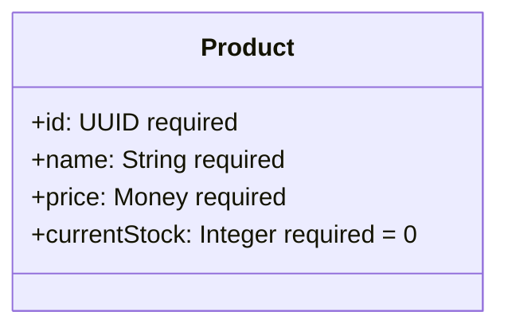
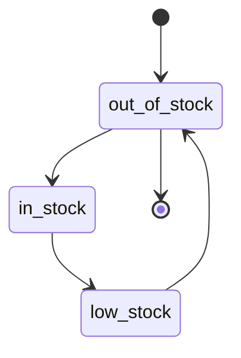

# Example 01-02: Model with Lifecycle

This example builds on basic models by adding state management through lifecycles, demonstrating how to track business process flows in SpecVerse v3.2.


## Visual Diagram

import Mermaid from '@site/src/components/Mermaid';


{/* Auto-generated diagram from canonical examples */}

{/* Generated: 2025-07-26T14:40:18.593Z */}

<div className="diagram-generated">

<Mermaid chart={`
classDiagram
    class Product {
        +id: UUID required
        +name: String required
        +price: Money required
        +currentStock: Integer required = 0
        +attachProfile(profileName: String): Boolean %% requires: Profile exists and is compatible with this model | ensures: Profile is attached, Profile attributes are available
        +detachProfile(profileName: String): Boolean %% requires: Profile is currently attached | ensures: Profile is detached, Profile attributes are no longer available
        +hasProfile(profileName: String): Boolean
    }
`} />

</div>


### Product - inventory Lifecycle


<Mermaid chart={`
stateDiagram-v2
    %% Product - inventory Lifecycle
    ___ --> out_of_stock : start
    out_of_stock --> in_stock : to_in_stock
    in_stock --> low_stock : to_low_stock
    low_stock --> out_of_stock : to_out_of_stock
`} />


## Learning Objectives

- Add lifecycle state management to models
- Use the concise flow syntax for linear progressions
- Understand multiple named lifecycles
- Implement declarative state transitions

## Key Concepts

### Lifecycle Definition
Models can have multiple named lifecycles that track different business processes:
```specly
lifecycles:
  inventory:
    flow: out_of_stock -> in_stock -> low_stock -> out_of_stock
```

### Flow Syntax
The flow syntax provides a concise way to define linear state progressions:
- **->**: Indicates transition direction
- **States**: Automatically extracted from the flow definition
- **Circular flows**: States can transition back to earlier states
- **Linear progression**: Perfect for simple workflows

### Complete Model Structure
In v3.2, the model with lifecycle is defined within the container format:
```specly
components:
  SpecVerseFundamentals:
    version: "3.2.0"
    description: "Example 01-02: Model with lifecycle state management"
    
    models:
      Product:
        description: "Product with inventory lifecycle management"
        attributes:
          id: UUID required
          name: String required
          price: Money required
          currentStock: Integer required default=0
        lifecycles:
          inventory:
            flow: out_of_stock -> in_stock -> low_stock -> out_of_stock

deployments: {}
```

### State Management Benefits
- **Process tracking**: Monitor business state changes
- **Validation**: Ensure valid state transitions
- **Event generation**: Trigger events on state changes
- **Business rules**: Enforce workflow constraints

## Visual Diagrams

### Model Structure


### Inventory Lifecycle Flow


## Complete Example

### Primary: Specly DSL Format (.specly)
```specly
components:
  SpecVerseFundamentals:
    version: "3.2.0"
    description: "Example 01-02: Model with lifecycle state management"
    
    export:
      models: [Product]
    
    import:
      - from: "@specverse/primitives"
        select: [Money]
    
    models:
      Product:
        description: "Product with inventory lifecycle management"
        attributes:
          id: UUID required
          name: String required
          price: Money required
          currentStock: Integer required default=0
        lifecycles:
          inventory:
            flow: out_of_stock -> in_stock -> low_stock -> out_of_stock

deployments: {}
```

See the full file: [01-02-model-with-lifecycle.specly](./01-02-model-with-lifecycle.specly)

### Generated: YAML Format
The YAML format is automatically generated from the Specly DSL using:
```bash
specverse gen yaml 01-02-model-with-lifecycle.specly -o 01-02-model-with-lifecycle.yaml
```

## Key Features Demonstrated

- **Lifecycle definitions**: Named state machines within models
- **Flow syntax**: Concise `state -> state -> state` transition notation
- **Circular workflows**: States can loop back (low_stock -> out_of_stock)
- **State tracking**: Business process management within the v3.2 container format

## Practical Use Cases

- **Inventory management**: Track stock levels and availability
- **Order processing**: Monitor order status from creation to fulfillment
- **User activation**: Track user registration and verification states
- **Document workflow**: Manage approval and publication states

## Validation

Test this example:
```bash
# Validate the Specly source file
specverse validate examples/01-fundamentals/01-02-model-with-lifecycle.specly

# Run full test cycle
specverse test cycle examples/01-fundamentals/01-02-model-with-lifecycle.specly
```

## Next Steps

Continue to [Example 01-03: Model with Behaviors](./01-03-model-with-behaviors) to learn about adding business logic through behaviors.

## Related Examples

- [Example 01-01: Basic Model](./01-01-basic-model) - Foundation model concepts  
- [Example 01-04: Models with Relations](./01-04-models-with-relations) - Adding relationships between models