# Example 11-09: Event Flow Layered Diagram

## Overview

This example demonstrates a **5-layer architecture with dual event bus pattern** for an e-commerce platform. It shows how domain events (business logic layer) and application events (UI notification layer) flow through different architectural layers.

## Generated Diagram

```mermaid
graph TD
  %% Event Flow Architecture

  subgraph layer3_services["⚙️ LAYER 3B: SERVICES"]
    direction LR
    PaymentService("PaymentService
↑ 3 events
↓ 1 events")
    InventoryService("InventoryService
↑ 3 events
↓ 1 events")
    NotificationService("NotificationService
↑ 2 events
↓ 2 events")
    AnalyticsService("AnalyticsService
↑ 2 events
↓ 2 events")
    LoyaltyService("LoyaltyService
↑ 1 events
↓ 1 events")
  end

  subgraph layer4_controllers["⚙️ LAYER 4A: CONTROLLERS"]
    direction LR
    OrderController("OrderController
↑ 3 events")
    ProductController("ProductController
↑ 2 events")
    CustomerController("CustomerController
↑ 2 events")
  end

  subgraph layer5_services["⚙️ LAYER 5B: SERVICES"]
    direction LR
    ShippingService("ShippingService
↑ 2 events
↓ 1 events")
  end

  subgraph layer3_events["🔔 LAYER 3: EVENTS"]
    direction LR
    OrderCreatedNotification{{"OrderCreatedNotification"}}
    PaymentSuccessNotification{{"PaymentSuccessNotification"}}
    ShippingNotification{{"ShippingNotification"}}
    InventoryUpdated{{"InventoryUpdated"}}
    PriceUpdateNotification{{"PriceUpdateNotification"}}
    WelcomeScreenShown{{"WelcomeScreenShown"}}
    PointsDisplayUpdated{{"PointsDisplayUpdated"}}
    OrderPlaced{{"OrderPlaced"}}
    PaymentConfirmed{{"PaymentConfirmed"}}
    OrderShipped{{"OrderShipped"}}
    OrderCompleted{{"OrderCompleted"}}
  end

  subgraph layer4_events["🔔 LAYER 4: EVENTS"]
    direction LR
    PaymentProcessed{{"PaymentProcessed"}}
    PaymentFailed{{"PaymentFailed"}}
    PaymentConfirmedNotification{{"PaymentConfirmedNotification"}}
    StockReserved{{"StockReserved"}}
    LowStockDetected{{"LowStockDetected"}}
    StockMonitoringAlert{{"StockMonitoringAlert"}}
    EmailSent{{"EmailSent"}}
    ShippingEmailSent{{"ShippingEmailSent"}}
    MetricsUpdated{{"MetricsUpdated"}}
    InventoryInsightsUpdated{{"InventoryInsightsUpdated"}}
    PointsAwarded{{"PointsAwarded"}}
  end

  subgraph layer6_events["🔔 LAYER 6: EVENTS"]
    direction LR
    ShipmentCreated{{"ShipmentCreated"}}
    TrackingUpdated{{"TrackingUpdated"}}
  end

  subgraph views_layer["🖥️ LAYER 5: VIEWS (User Interface)"]
    direction LR
    OrderDashboard("OrderDashboard")
    ProductCatalog("ProductCatalog")
    CustomerProfile("CustomerProfile")
    TrackingPage("TrackingPage")
    CheckoutFlow("CheckoutFlow")
    AdminAnalytics("AdminAnalytics")
  end


  %% Relationships
  OrderController -->|"publishes"| OrderCreatedNotification
  OrderController -->|"publishes"| PaymentSuccessNotification
  OrderController -->|"publishes"| ShippingNotification
  ProductController -->|"publishes"| InventoryUpdated
  ProductController -->|"publishes"| PriceUpdateNotification
  CustomerController -->|"publishes"| WelcomeScreenShown
  CustomerController -->|"publishes"| PointsDisplayUpdated
  PaymentService -->|"publishes"| PaymentProcessed
  PaymentService -->|"publishes"| PaymentFailed
  PaymentService -->|"publishes"| PaymentConfirmedNotification
  InventoryService -->|"publishes"| StockReserved
  InventoryService -->|"publishes"| LowStockDetected
  InventoryService -->|"publishes"| StockMonitoringAlert
  ShippingService -->|"publishes"| ShipmentCreated
  ShippingService -->|"publishes"| TrackingUpdated
  NotificationService -->|"publishes"| EmailSent
  NotificationService -->|"publishes"| ShippingEmailSent
  AnalyticsService -->|"publishes"| MetricsUpdated
  AnalyticsService -->|"publishes"| InventoryInsightsUpdated
  LoyaltyService -->|"publishes"| PointsAwarded
  StockReserved -.->|"subscribes"| ShippingService

  style OrderCreatedNotification fill:#ffe0b2,stroke:#e65100,stroke-width:2px,color:#000
  style PaymentSuccessNotification fill:#ffe0b2,stroke:#e65100,stroke-width:2px,color:#000
  style ShippingNotification fill:#ffe0b2,stroke:#e65100,stroke-width:2px,color:#000
  style InventoryUpdated fill:#ffe0b2,stroke:#e65100,stroke-width:2px,color:#000
  style PriceUpdateNotification fill:#ffe0b2,stroke:#e65100,stroke-width:2px,color:#000
  style WelcomeScreenShown fill:#ffe0b2,stroke:#e65100,stroke-width:2px,color:#000
  style PointsDisplayUpdated fill:#ffe0b2,stroke:#e65100,stroke-width:2px,color:#000
  style PaymentProcessed fill:#ffe0b2,stroke:#e65100,stroke-width:2px,color:#000
  style PaymentFailed fill:#ffe0b2,stroke:#e65100,stroke-width:2px,color:#000
  style PaymentConfirmedNotification fill:#ffe0b2,stroke:#e65100,stroke-width:2px,color:#000
  style OrderPlaced fill:#ffe0b2,stroke:#e65100,stroke-width:2px,color:#000
  style StockReserved fill:#ffe0b2,stroke:#e65100,stroke-width:2px,color:#000
  style LowStockDetected fill:#ffe0b2,stroke:#e65100,stroke-width:2px,color:#000
  style StockMonitoringAlert fill:#ffe0b2,stroke:#e65100,stroke-width:2px,color:#000
  style PaymentConfirmed fill:#ffe0b2,stroke:#e65100,stroke-width:2px,color:#000
  style ShipmentCreated fill:#ffe0b2,stroke:#e65100,stroke-width:2px,color:#000
  style TrackingUpdated fill:#ffe0b2,stroke:#e65100,stroke-width:2px,color:#000
  style EmailSent fill:#ffe0b2,stroke:#e65100,stroke-width:2px,color:#000
  style ShippingEmailSent fill:#ffe0b2,stroke:#e65100,stroke-width:2px,color:#000
  style OrderShipped fill:#ffe0b2,stroke:#e65100,stroke-width:2px,color:#000
  style MetricsUpdated fill:#ffe0b2,stroke:#e65100,stroke-width:2px,color:#000
  style InventoryInsightsUpdated fill:#ffe0b2,stroke:#e65100,stroke-width:2px,color:#000
  style OrderCompleted fill:#ffe0b2,stroke:#e65100,stroke-width:2px,color:#000
  style PointsAwarded fill:#ffe0b2,stroke:#e65100,stroke-width:2px,color:#000
  style OrderController fill:#f3e5f5,stroke:#4a148c,stroke-width:2px,color:#000
  style ProductController fill:#f3e5f5,stroke:#4a148c,stroke-width:2px,color:#000
  style CustomerController fill:#f3e5f5,stroke:#4a148c,stroke-width:2px,color:#000
  style PaymentService fill:#e8f5e9,stroke:#1b5e20,stroke-width:2px,color:#000
  style InventoryService fill:#e8f5e9,stroke:#1b5e20,stroke-width:2px,color:#000
  style ShippingService fill:#e8f5e9,stroke:#1b5e20,stroke-width:2px,color:#000
  style NotificationService fill:#e8f5e9,stroke:#1b5e20,stroke-width:2px,color:#000
  style AnalyticsService fill:#e8f5e9,stroke:#1b5e20,stroke-width:2px,color:#000
  style LoyaltyService fill:#e8f5e9,stroke:#1b5e20,stroke-width:2px,color:#000
  style OrderDashboard fill:#fce4ec,stroke:#880e4f,stroke-width:2px,color:#000
  style ProductCatalog fill:#fce4ec,stroke:#880e4f,stroke-width:2px,color:#000
  style CustomerProfile fill:#fce4ec,stroke:#880e4f,stroke-width:2px,color:#000
  style TrackingPage fill:#fce4ec,stroke:#880e4f,stroke-width:2px,color:#000
  style CheckoutFlow fill:#fce4ec,stroke:#880e4f,stroke-width:2px,color:#000
  style AdminAnalytics fill:#fce4ec,stroke:#880e4f,stroke-width:2px,color:#000
```



## Diagram Types Generated

- **event-flow-layered**: Shows the 5-layer architecture with event flow
- Plus 10 other unified diagram types

## Architecture Pattern

### 5-Layer Architecture:
1. **Layer 1: Models** - Core business entities (Order, Product, Payment, Customer, Shipment)
2. **Layer 2: Domain Events** - Business logic events (OrderPlaced, PaymentConfirmed, StockReserved)
3. **Layer 3: Controllers & Services** - Application logic that subscribes to domain events and publishes app events
4. **Layer 4: Application Events** - UI notification events (OrderCreatedNotification, PaymentSuccessNotification)
5. **Layer 5: Views** - UI components that subscribe to application events

### Dual Event Bus Pattern:
- **Domain Event Bus**: Handles business logic events between services
- **Application Event Bus**: Handles UI notification events to views

## Key Features

### Models (5)
- **Order**: Customer order with complete workflow
- **Product**: Product with inventory management
- **Payment**: Payment transaction
- **Customer**: Customer account with loyalty points
- **Shipment**: Shipment tracking

### Controllers (3)
- **OrderController**: Handles order domain events, publishes app events
- **ProductController**: Handles product domain events, publishes app events
- **CustomerController**: Handles customer domain events, publishes app events

### Services (6)
- **PaymentService**: Processes payments, subscribes to OrderPlaced
- **InventoryService**: Manages inventory, subscribes to PaymentConfirmed
- **ShippingService**: Coordinates shipping, subscribes to StockReserved
- **NotificationService**: Sends notifications
- **AnalyticsService**: Tracks metrics across all events
- **LoyaltyService**: Manages loyalty program

### Domain Events (22)
Order flow: OrderPlaced, PaymentConfirmed, OrderShipped, OrderCompleted, OrderCancelled

Inventory: StockReserved, LowStockDetected, PriceChanged, StockReplenished

Payment: PaymentProcessed, PaymentFailed, RefundProcessed

Customer: CustomerRegistered, PointsAwarded, ProfileUpdated

Shipping: ShipmentCreated, TrackingUpdated, ShipmentDelivered

### Application Events (15)
UI notifications for orders, payments, shipping, inventory updates, customer interactions

### Views (6)
- OrderDashboard, ProductCatalog, CustomerProfile, TrackingPage, CheckoutFlow, AdminAnalytics

## Event Flow Example

```
1. OrderPlaced (Domain) → PaymentService.processPayment()
2. PaymentProcessed (Domain) → PaymentConfirmed (Domain)
3. PaymentConfirmed (Domain) → InventoryService.reserveStock()
4. StockReserved (Domain) → ShippingService.createShipment()
5. OrderController.handleOrderPlaced() → OrderCreatedNotification (App Event)
6. OrderCreatedNotification → OrderDashboard.update()
```

## Use Cases

- E-commerce platforms with complex order workflows
- Systems requiring separation between business logic and UI events
- Event-driven architectures with multiple subscriber patterns
- Applications needing clear layer separation

## Related Examples

- **11-01**: Basic event flow sequence
- **11-02**: Event flow with swimlanes
- **11-08**: Deployment topology with event bus
