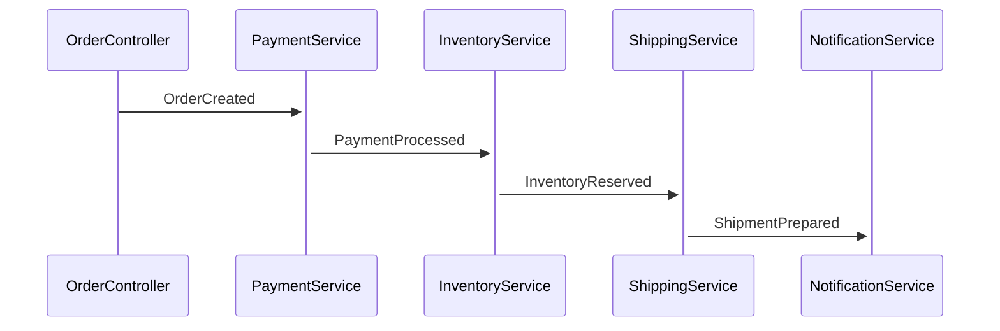

# Event Flow Sequence Diagram

**Example**: `11-01-event-flow-sequence-demo.specly`
**Diagram Type**: `event-flow-sequence`
**Status**: ✅ Fully Implemented

## Overview

The **event-flow-sequence** diagram visualizes temporal event flows in your SpecVerse application, showing how events propagate through controllers and services in sequence. This diagram is ideal for understanding:

- Event-driven architecture patterns
- Temporal ordering of event processing
- Publisher-subscriber relationships
- Event chain reactions and cascading flows

## What This Example Demonstrates

This example shows a complete **order processing workflow** with sequential event flows:

1. **OrderController** publishes `OrderCreated` event
2. **PaymentService** subscribes to `OrderCreated`, processes payment, publishes `PaymentProcessed`
3. **InventoryService** subscribes to `PaymentProcessed`, reserves inventory, publishes `InventoryReserved`
4. **ShippingService** subscribes to `InventoryReserved`, prepares shipment, publishes `ShipmentPrepared`
5. **NotificationService** subscribes to `ShipmentPrepared`, sends confirmation, publishes `CustomerNotified`

## Key Features

### 1. Temporal Event Visualization

The sequence diagram shows events in the order they occur:



### 2. Activation Boxes

Services are shown as "activated" when processing events, visualizing concurrent processing and dependencies.

### 3. Event Chaining

The diagram automatically detects event chains where:
- Service A publishes Event X
- Service B subscribes to Event X and publishes Event Y
- Service C subscribes to Event Y

### 4. Participant Aliases

Long service names are abbreviated for clarity:
- `OrderController` → `OR`
- `PaymentService` → `PA`
- `InventoryService` → `IN`
- `ShippingService` → `SH`
- `NotificationService` → `NO`

## How to Generate

### Generate Event Flow Sequence Diagram

```bash
# Generate sequence diagram
specverse gen diagram 11-01-event-flow-sequence-demo.specly -d event-flow-sequence

# With custom output location
specverse gen diagram 11-01-event-flow-sequence-demo.specly -d event-flow-sequence -o ./docs/sequence.mmd

# With dark theme
specverse gen diagram 11-01-event-flow-sequence-demo.specly -d event-flow-sequence -t dark-mode
```

### Generate All Diagram Types

```bash
# Generate all diagram types including sequence
specverse gen diagram 11-01-event-flow-sequence-demo.specly
```

## Understanding the Specification

### Event Subscriptions

Services subscribe to events using the `subscribes_to` property:

```yaml
services:
  PaymentService:
    description: "Process payments and handle financial transactions"
    subscribes_to:
      OrderCreated: processPayment    # Event: Handler

    operations:
      processPayment:
        publishes: [PaymentProcessed, PaymentFailed]
```

**Key Points:**
- `subscribes_to` maps event names to handler operations
- Handlers must be defined in the `operations` section
- Multiple events can be subscribed to by one service
- Services can publish multiple events from one operation

### Event Publishing

Controllers and services publish events through actions/operations:

```yaml
controllers:
  OrderController:
    actions:
      createOrder:
        publishes: [OrderCreated]    # List of published events
```

### Event Definitions

Events define the payload structure:

```yaml
events:
  OrderCreated:
    description: "New order has been created"
    attributes:
      orderId: UUID required
      customerId: UUID required
      total: Money required
      itemCount: Integer required
      createdAt: DateTime required
```

## Event Flow Analysis

### Happy Path Flow

1. **User Action** → OrderController.createOrder()
2. **Event: OrderCreated** → PaymentService.processPayment()
3. **Event: PaymentProcessed** → InventoryService.reserveItems()
4. **Event: InventoryReserved** → ShippingService.prepareShipment()
5. **Event: ShipmentPrepared** → NotificationService.sendConfirmation()
6. **Event: CustomerNotified** → End of flow

### Alternative Flows (Not Shown in Diagram)

The specification also includes failure events:
- `PaymentFailed` - Published by PaymentService if payment fails
- `InsufficientStock` - Published by InventoryService if stock unavailable

These alternative flows could be visualized by adding error handling services.

## Use Cases

### When to Use Event Flow Sequence Diagrams

1. **Understanding Event Chains**: See how events trigger subsequent events
2. **Debugging Event Flows**: Trace event propagation issues
3. **Architecture Documentation**: Document event-driven patterns
4. **Onboarding**: Help new developers understand system flows
5. **Performance Analysis**: Identify long event chains that might need optimization

### Complementary Diagrams

Use with other diagram types for complete understanding:

- **event-flow-layered**: See 5-layer architecture with all event buses
- **event-flow-swimlane**: See parallel event processing by component
- **deployment-topology**: See how services are deployed
- **service-architecture**: See service dependencies beyond events

## Advanced Features

### Multiple Event Chains

If your specification has multiple independent event flows, the diagram will show all chains:

```yaml
# Chain 1: Order processing (shown in this example)
OrderCreated → PaymentProcessed → InventoryReserved → ...

# Chain 2: Inventory management (could be added)
StockUpdated → PriceAdjusted → CatalogUpdated → ...
```

### Circular Dependencies

The diagram generator includes depth limiting (max 10 levels) to prevent infinite loops if circular event dependencies exist.

### Empty Specifications

If no event subscriptions are found, the diagram will show:
```
Note over Participants: No event flow sequences detected
```

## Customization Options

### Theme Options

```bash
# Light theme (default)
specverse gen diagram 11-01-event-flow-sequence-demo.specly -d event-flow-sequence -t default

# Dark theme
specverse gen diagram 11-01-event-flow-sequence-demo.specly -d event-flow-sequence -t dark-mode

# Colorblind-safe palette
specverse gen diagram 11-01-event-flow-sequence-demo.specly -d event-flow-sequence -t colorblind-safe

# High-contrast for presentations
specverse gen diagram 11-01-event-flow-sequence-demo.specly -d event-flow-sequence -t presentation
```

## Mermaid Integration

The generated `.mmd` file can be used with:

- **Mermaid Live Editor**: https://mermaid.live
- **GitHub Markdown**: Automatically renders in README files
- **Documentation Generators**: Docusaurus, MkDocs, etc.
- **IDE Extensions**: VSCode, IntelliJ mermaid plugins

### Example in Markdown

````markdown

````

## Best Practices

### 1. Keep Event Chains Manageable

Long event chains (>5 steps) can indicate tight coupling. Consider:
- Breaking into multiple workflows
- Using saga patterns for complex orchestration
- Adding timeout handling

### 2. Document Event Payloads

Always include detailed event definitions:
```yaml
events:
  OrderCreated:
    description: "Clear description of when and why this event fires"
    attributes:
      # All relevant payload fields with types
```

### 3. Name Events Clearly

Use past-tense verbs for events:
- ✅ `OrderCreated`, `PaymentProcessed`, `InventoryReserved`
- ❌ `CreateOrder`, `ProcessPayment`, `ReserveInventory`

### 4. Single Responsibility

Each service should have a clear, focused purpose:
- PaymentService: Handles payments only
- InventoryService: Manages inventory only
- NotificationService: Sends notifications only

## Troubleshooting

### No Diagram Generated

**Issue**: Empty or minimal diagram output

**Solutions**:
1. Verify `subscribes_to` properties are correctly defined
2. Ensure event names match exactly (case-sensitive)
3. Check that events are defined in `events:` section
4. Confirm services have `operations` with `publishes`

### Events Not Connecting

**Issue**: Events shown but not connected in sequence

**Solutions**:
1. Verify subscriber operation actually publishes the next event
2. Check event name spelling matches exactly
3. Ensure chain is complete (no missing links)

### Participant Names Too Long

**Issue**: Diagram is hard to read with long service names

**Solutions**:
- The diagram automatically creates 2-letter aliases
- Consider shorter service names in specification if needed
- Use horizontal layout for better readability

## Related Examples

- **03-05-complete-event-flow.specly**: More complex event flow example
- **09-02-event-flow-swimlane-demo.specly**: Parallel event visualization
- **09-03-mvc-architecture-demo.specly**: MVC architecture overview

## Version History

- **v3.2.7**: Initial implementation of event-flow-sequence diagram
- Supports temporal event visualization
- Automatic participant extraction
- Event chain detection
- Depth limiting for circular dependencies

## Learn More

- [SpecVerse Documentation](https://docs.specverse.com)
- [Event-Driven Architecture Guide](https://docs.specverse.com/patterns/event-driven)
- [Mermaid Sequence Diagrams](https://mermaid.js.org/syntax/sequenceDiagram.html)
