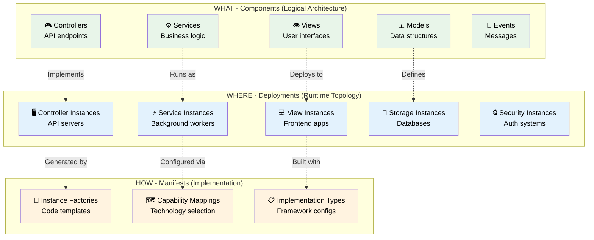
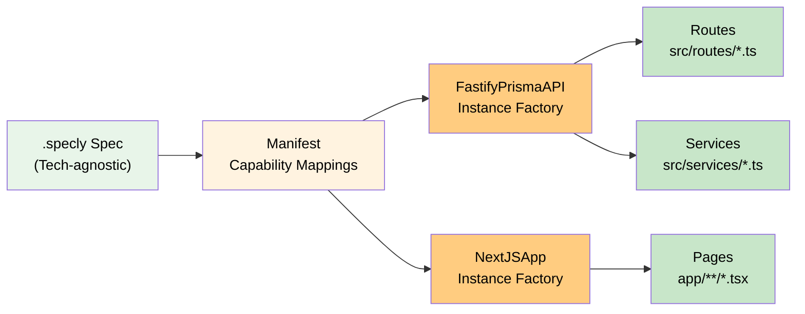

<!-- This file is auto-generated from schema/SPECVERSE-COMPLETE-GUIDE.md
     Do not edit directly - changes will be overwritten
     To update: modify the source file and run 'npm run build' -->

# SpecVerse Complete Guide
*Reference Documentation + Practical Examples*
*Version 3.4.9*

## Table of Contents
1. [Overview](#overview)
2. [Quick Start](#quick-start)
3. [Convention Syntax](#convention-syntax)
4. [Structure Reference](#structure-reference)
5. [Practical Examples](#practical-examples)
6. [AI Development](#ai-development)
7. [Deployment Patterns](#deployment-patterns)
8. [Manifest System](#manifest-system)
9. [Best Practices](#best-practices)
10. [Command Reference](#command-reference)

---

## Overview

SpecVerse is a declarative specification language designed for seamless communication between humans and AI systems. It enables you to describe complete applications through specifications that define **what** needs to be done rather than **how** to do it.

### Core Concepts

### Specifications (.specly files)
Define the logical architecture of your application - the models, business logic, and user interfaces. Think of this as your application's blueprint. They can contain each of:

- `Components` : Logical groupings of related functionality that form the building blocks of your application. Each component is self-contained and can be imported by others.

- `Deployments` : Define how components are instantiated and run in real environments, from local development to enterprise production.

- `Manifests` : Provide implementation guidance - which technologies to use, how to map specifications to real code, and deployment configurations. Manifests are integrated into the unified SpecVerse schema using the `manifests:` container format.

### Libraries : 
Specifications can also import from and export to standardized libraries to maintain DRY principles across projects.

They can leverage pre-built patterns from `@specverse/standards` libraries eg:
- `@specverse/standards/types` - Common data types
- `@specverse/standards/business` - Business domain patterns
- `@specverse/standards/nextjs` - Next.js implementation patterns
- `@specverse/standards/nestjs` - NestJS backend patterns
- `@specverse/standards/database` - Database schemas and patterns


### Tooling :
Specverse provides tooling that:
- Validates specifications
- Infers complete specifications from a minimal model spec (the standard controllers/views etc - 4x/8x expansion)
- Documents and diagrams specifications
- Provides prompts and supporting artifacts for AI engines
- Provides a VS-Code extension that makes the above available inside VS-Code
- Provides an MCP server that makes the above available to AI engines

### The SpecVerse Architecture



---

## Quick Start

### Minimal Example
```yaml
components:
  BlogSystem:
    version: "1.0.0"
    description: "Simple blog with posts and authors"

    models:
      Author:
        attributes:
          name: String required
          email: Email required unique

      Post:
        attributes:
          title: String required
          content: String required
          publishedAt: DateTime optional
        relationships:
          author: belongsTo Author
```

### With Deployment
```yaml
components:
  BlogSystem:
    version: "1.0.0"
    models:
      # ... models here ...

deployments:
  development:
    version: "1.0.0"
    environment: development
    instances:
      controllers:
        blog-api:
          component: "BlogSystem"
          scale: 1
      storage:
        blog-db:
          component: "BlogSystem"
          type: "relational"
          persistence: "durable"
```

---

## Convention Syntax

SpecVerse uses powerful shorthand conventions to reduce boilerplate by 90%:

### Attribute Conventions
```yaml
# Basic pattern:
attributeName: TypeName modifiers
attributeName: TypeName[] modifiers  # Array syntax for collections

# Examples:
email: Email required unique
name: String required
age: Integer min=0 max=150
status: String default="active" values=["pending","active","inactive"]
tags: String[] optional  # Array of strings
scores: Integer[] required  # Array of integers
flags: Boolean[] optional  # Array of booleans
price: Money currency=USD
createdAt: DateTime auto=now
id: UUID auto=uuid4
```

### Relationship Conventions
```yaml
# Pattern:
relationshipName: relationshipType TargetModel options

# Examples:
author: belongsTo Author
posts: hasMany Post cascade
tags: manyToMany Tag through=PostTag
profile: hasOne Profile dependent
```

### Lifecycle Conventions
```yaml
# Shorthand flow:
status:
  flow: draft -> published -> archived

# Or detailed:
approval:
  states: [pending, approved, rejected]
  transitions:
    approve: pending -> approved
    reject: pending -> rejected
```

---

## Structure Reference

### Top Level Structure

Every SpecVerse specification must have at least one of:
- **components**: Define logical architecture
- **deployments**: Define runtime configuration

```yaml
# Complete structure
components:
  ComponentName:
    # ... component definition ...

deployments:
  DeploymentName:
    # ... deployment definition ...
```

### Components

Components are the core building blocks containing your application's logical architecture.

```yaml
components:
  ComponentName:  # Can use namespaces: @org/package
    version: "1.0.0"  # Required
    description: "Component purpose"
    tags: ["tag1", "tag2"]

    # Import/Export
    import: [...]     # Bring in external types
    export: [...]     # Share types with others

    # Type Definitions
    primitives: {...} # Custom data types
    models: {...}     # Data structures
    controllers: {...} # Request handlers
    services: {...}   # Business logic
    views: {...}      # User interfaces
    events: {...}     # Message payloads
```

### Models

Models represent the core data structures of your application.

```yaml
models:
  User:
    description: "System user"
    extends: BaseModel          # Inheritance
    profiles: [Auditable]       # Attached profiles

    attributes:
      # Convention syntax
      email: Email required unique
      name: String required
      age: Integer min=0 max=150

      # Or explicit syntax
      status:
        type: String
        required: true
        default: "active"
        values: ["active", "inactive", "suspended"]

    relationships:
      posts: hasMany Post cascade
      profile: hasOne Profile dependent
      groups: manyToMany Group through=UserGroup
      organization: belongsTo Organization

    lifecycles:
      status:
        flow: pending -> active -> suspended -> deleted

    behaviors:
      sendWelcomeEmail:
        description: "Send welcome email to new user"
        publishes: UserWelcomed
        steps:
          - "Generate welcome message"
          - "Send email"
          - "Log communication"

    profile-attachment:
      profiles: [Document, Task]  # Can attach to these models
      conditions:
        requiresAudit: "true"
      priority: 10
```

#### Model Metadata (Auto-Generated Fields)

SpecVerse automatically generates common synthetic attributes through the `metadata` property, reducing boilerplate:

```yaml
User:
  metadata:
    id: uuid                    # ID strategy: uuid | integer | auto | composite | manual
    label: [firstName, lastName] # Display fields for UIs
    audit:
      timestamps: true          # Adds: createdAt, updatedAt
      users: true               # Adds: createdBy, updatedBy
    softDelete: true            # Adds: deletedAt, isDeleted
    status: true                # Status from lifecycle or explicit values
    version: true               # Adds version for optimistic locking
  attributes:
    firstName: String required
    lastName: String required
    email: String required unique
```

**Metadata Options:**

| Option | Description | Generated Fields |
|--------|-------------|------------------|
| `id` | ID generation strategy | `id` field with specified type |
| `label` | Display label field(s) | Used by UIs for entity display |
| `audit.timestamps` | Timestamp tracking | `createdAt`, `updatedAt` |
| `audit.users` | User tracking | `createdBy`, `updatedBy` |
| `softDelete` | Soft delete support | `deletedAt`, `isDeleted` |
| `status` | Status field | From lifecycle or explicit values |
| `version` | Optimistic locking | Version counter (integer or timestamp) |

**Note:** Don't manually define fields that metadata generates (like `id`, `createdAt`, etc.). The system provides them automatically.

#### Attributes Reference

Attributes define data fields with these properties:

| Property | Description | Example |
|----------|-------------|---------|
| type | Data type (String, Integer, Boolean, etc.) | `String` |
| required | Field must be provided | `required` |
| optional | Field is optional (default) | `optional` |
| unique | Must be unique across records | `unique` |
| auto | Auto-generated value | `auto=uuid4`, `auto=now` |
| min/max | Numeric bounds | `min=0 max=100` |
| default | Default value | `default="active"` |
| verified | Needs verification | `verified` |
| searchable | Index for searching | `searchable` |
| values | Enumerated options | `values=["a","b","c"]` |

#### Relationships Reference

| Type | Description | Inverse | Example |
|------|-------------|---------|---------|
| hasMany | One to many | belongsTo | `posts: hasMany Post` |
| hasOne | One to one | belongsTo | `profile: hasOne Profile` |
| belongsTo | Many to one | hasMany/hasOne | `author: belongsTo User` |
| manyToMany | Many to many | manyToMany | `tags: manyToMany Tag` |

Options: `cascade`, `dependent`, `eager`, `lazy`, `through=ModelName`

### Controllers

Controllers handle incoming requests and define API endpoints.

```yaml
controllers:
  UserController:
    model: User
    path: "/api/users"
    description: "User management endpoints"

    subscribes_to: [UserCreated, UserUpdated]

    cured:
      create:
        description: "Create new user"
        publishes: UserCreated
      retrieve:
        description: "Get single user"
      retrieve_many:
        description: "List users"
        parameters:
          limit: Integer default=10 max=100
          offset: Integer default=0
      update:
        description: "Update user"
        publishes: UserUpdated
      evolve:
        description: "Change user state"
        publishes: UserStateChanged
      delete:
        description: "Delete user"
        publishes: UserDeleted

    actions:
      resetPassword:
        description: "Reset user password"
        parameters:
          email: Email required
        publishes: PasswordResetRequested
        steps:
          - "Validate email"
          - "Generate reset token"
          - "Send reset email"
```

### Services

Services contain reusable business logic.

```yaml
services:
  NotificationService:
    description: "Handle notifications"
    subscribes_to: [UserCreated, OrderCompleted]

    operations:
      sendEmail:
        description: "Send email notification"
        parameters:
          to: Email required
          subject: String required
          body: String required
        returns: Boolean
        steps:
          - "Validate recipient"
          - "Format message"
          - "Queue for delivery"

      sendSMS:
        description: "Send SMS notification"
        parameters:
          phone: PhoneNumber required
          message: String required max=160
        returns: Boolean
```

### Views

Views define user interface components.

```yaml
views:
  UserListView:
    description: "Display list of users"
    type: "list"
    model: User
    tags: ["admin", "dashboard"]
    export: true

    subscribes_to: [UserCreated, UserUpdated, UserDeleted]

    layout:
      columns: ["name", "email", "status", "createdAt"]
      sortable: true
      filterable: true
      pagination: true

    uiComponents:  # v3.5.0+, replaces 'components'
      searchBar: { type: "search", target: ["name", "email"] }
      actionButtons: { type: "actions", items: ["create", "export"] }

    properties:
      responsive: true
      authenticated: true
      sortable: true
```

### Events

Events define message payloads for system communication.

```yaml
events:
  UserCreated:
    description: "Fired when new user is created"
    attributes:
      userId: UUID required
      email: Email required
      timestamp: DateTime required auto=now
      metadata: String optional
```

### Primitives

Define custom reusable data types.

```yaml
primitives:
  # Convention syntax
  PhoneNumber: String pattern="^\\+[1-9]\\d{1,14}$"

  # Or explicit syntax
  Money:
    baseType: Number
    validation:
      min: 0
      max: 1000000
    description: "Monetary amount"

  Status:
    baseType: String
    validation:
      values: ["pending", "active", "suspended", "deleted"]
```

---

## Deployments

Deployments specify how components run in different environments.

```yaml
deployments:
  production:
    version: "1.0.0"
    environment: production
    instances:
      # Categories of instances
      controllers: {...}
      services: {...}
      views: {...}
      communications: {...}
      storage: {...}
      security: {...}
      infrastructure: {...}
      monitoring: {...}
```

### Instance Types Reference

#### Controllers/Services/Views
```yaml
controllers:
  api-server:
    component: "ComponentName"
    namespace: "api"
    advertises: "*"  # or ["capability1", "capability2"]
    uses: ["database.*", "cache.*"]
    scale: 3
    config:
      port: 8080
      timeout: 30
```

#### Storage
```yaml
storage:
  main-db:
    component: "ComponentName"
    type: "relational"  # relational|document|keyvalue|cache|file|blob|queue|search
    provider: "postgresql"
    persistence: "durable"  # durable|session|cache|temporary
    consistency: "strong"   # strong|eventual|weak
    scale: 2
    replication: 2
    backup: true
    encryption: true
```

#### Security
```yaml
security:
  auth-system:
    component: "ComponentName"
    type: "authentication"  # authentication|authorization|encryption|audit|firewall|scanning|secrets|identity
    provider: "oauth"      # oauth|saml|jwt|ldap|local|external|cloud|enterprise
    scope: "global"        # global|component|namespace|instance|user|role
    policies: ["mfa", "session-timeout"]
    protocols: ["oauth2", "openid"]
    encryption: "strong"   # none|basic|strong|enterprise
    auditLevel: "detailed" # none|basic|detailed|comprehensive
```

#### Infrastructure
```yaml
infrastructure:
  load-balancer:
    component: "ComponentName"
    type: "loadbalancer"  # gateway|loadbalancer|proxy|cdn|dns|registry|mesh|ingress
    provider: "nginx"     # aws|gcp|azure|cloudflare|vercel|netlify|kubernetes|istio|envoy|nginx|traefik|consul|local
    tier: "regional"      # edge|regional|global|local
    redundancy: "high"    # none|basic|high|enterprise
    protocols: ["http", "https", "websocket"]
    endpoints: ["api.example.com", "ws.example.com"]
    healthChecks: true
    autoScaling: true
```

#### Monitoring
```yaml
monitoring:
  metrics-system:
    component: "ComponentName"
    type: "metrics"        # metrics|logging|tracing|alerting|analytics|profiling|uptime|synthetic
    provider: "prometheus" # prometheus|grafana|datadog|newrelic|splunk|elasticsearch|jaeger|zipkin|sentry|rollbar|cloudwatch|stackdriver|azure-monitor|local
    scope: "component"     # global|component|namespace|instance|service|request
    retention: "medium"    # short|medium|long|permanent
    resolution: "high"     # high|medium|low
    sampling: 1.0         # 0.0 to 1.0
    dashboards: ["overview", "performance", "errors"]
    alerts: ["high-cpu", "low-memory", "error-rate"]
    aggregation: true
    realtime: false
```

#### Communications
```yaml
communications:
  event-bus:
    namespace: "global"
    capabilities: ["*"]
    type: "pubsub"  # pubsub|streaming|rpc|queue
    config:
      broker: "redis"
      retention: "24h"
```

---

## Practical Examples

### Personal Blog (Simple Scale)
```yaml
components:
  PersonalBlog:
    version: "1.0.0"
    description: "Personal blogging platform"

    models:
      Post:
        attributes:
          title: String required
          slug: String required unique
          content: String required
          publishedAt: DateTime optional
          tags: String[] optional
        lifecycles:
          status:
            flow: draft -> published -> archived

deployments:
  personal:
    version: "1.0.0"
    environment: development
    instances:
      controllers:
        blog-api:
          component: "PersonalBlog"
          scale: 1
      storage:
        sqlite-db:
          component: "PersonalBlog"
          type: "relational"
          provider: "sqlite"
          persistence: "durable"
```

### E-Commerce Platform (Business Scale)
```yaml
components:
  ECommerce:
    version: "1.0.0"
    description: "Online shopping platform"

    models:
      Product:
        attributes:
          name: String required searchable
          sku: String required unique
          price: Money required currency=USD
          inventory: Integer required min=0
          category: String required
        relationships:
          reviews: hasMany Review
          orders: manyToMany Order through=OrderItem
        lifecycles:
          availability:
            flow: draft -> available -> outOfStock -> discontinued

      Order:
        attributes:
          orderNumber: String required unique auto=sequence
          total: Money required currency=USD
          status: String required
        relationships:
          customer: belongsTo Customer
          items: hasMany OrderItem cascade
        lifecycles:
          fulfillment:
            states: [pending, paid, processing, shipped, delivered, cancelled]
            transitions:
              pay: pending -> paid
              process: paid -> processing
              ship: processing -> shipped
              deliver: shipped -> delivered
              cancel: "* -> cancelled"

deployments:
  production:
    version: "1.0.0"
    environment: production
    instances:
      controllers:
        api-gateway:
          component: "ECommerce"
          scale: 3
          advertises: "api.*"
      services:
        order-processor:
          component: "ECommerce"
          scale: 2
          advertises: "orders.*"
      storage:
        postgres-db:
          component: "ECommerce"
          type: "relational"
          provider: "postgresql"
          persistence: "durable"
          consistency: "strong"
          scale: 2
          backup: true
        redis-cache:
          component: "ECommerce"
          type: "keyvalue"
          provider: "redis"
          persistence: "cache"
      security:
        auth-service:
          component: "ECommerce"
          type: "authentication"
          provider: "jwt"
          scope: "global"
```

### Enterprise SaaS (Enterprise Scale)
```yaml
components:
  EnterpriseSaaS:
    version: "1.0.0"
    description: "Multi-tenant SaaS platform"

    import:
      - from: "@specverse/primitives"
        select: [Money, Address, PhoneNumber]
      - from: "@specverse/business"
        select: [Organization]

    models:
      Tenant:
        attributes:
          name: String required
          subdomain: String required unique
          plan: String required values=["starter","professional","enterprise"]
          seats: Integer required min=1
          billingEmail: Email required
        relationships:
          users: hasMany User cascade
          subscription: hasOne Subscription
        lifecycles:
          account:
            states: [trial, active, suspended, cancelled]
            transitions:
              activate: trial -> active
              suspend: active -> suspended
              reactivate: suspended -> active
              cancel: "* -> cancelled"

      User:
        profiles: [Auditable, Taggable]
        attributes:
          email: Email required unique
          name: String required
          role: String required values=["admin","manager","member","readonly"]
        relationships:
          tenant: belongsTo Tenant
          permissions: manyToMany Permission through=UserPermission
        behaviors:
          hasPermission:
            parameters:
              permission: String required
            returns: Boolean
            steps:
              - "Check user role permissions"
              - "Check explicit permissions"
              - "Apply tenant-level overrides"

deployments:
  enterprise:
    version: "1.0.0"
    environment: production
    instances:
      controllers:
        api-gateway:
          component: "EnterpriseSaaS"
          scale: 10
          advertises: "api.*"
      services:
        tenant-manager:
          component: "EnterpriseSaaS"
          scale: 5
          advertises: "tenants.*"
        billing-service:
          component: "EnterpriseSaaS"
          scale: 3
          advertises: "billing.*"
      storage:
        primary-db:
          component: "EnterpriseSaaS"
          type: "relational"
          provider: "postgresql"
          persistence: "durable"
          consistency: "strong"
          scale: 5
          replication: 2
          backup: true
          encryption: true
        cache-cluster:
          component: "EnterpriseSaaS"
          type: "keyvalue"
          provider: "redis"
          persistence: "cache"
          scale: 3
      security:
        sso-auth:
          component: "EnterpriseSaaS"
          type: "authentication"
          provider: "enterprise"
          scope: "global"
          policies: ["sso", "mfa", "compliance"]
          protocols: ["saml", "oauth2", "openid"]
          encryption: "enterprise"
          auditLevel: "comprehensive"
      monitoring:
        apm:
          component: "EnterpriseSaaS"
          type: "metrics"
          provider: "datadog"
          scope: "global"
          retention: "long"
          resolution: "high"
          dashboards: ["executive", "operations", "technical"]
          alerts: ["sla-breach", "high-error-rate", "security-event"]
      infrastructure:
        cdn:
          component: "EnterpriseSaaS"
          type: "cdn"
          provider: "cloudflare"
          tier: "global"
          redundancy: "enterprise"
```

---

## AI Development

### AI Operations

SpecVerse supports two primary AI operations:

#### `analyse` - Extract specifications from existing code
```bash
# Extract specification from implementation
specverse ai analyse /path/to/codebase -o specs/extracted.specly

# Focus areas during analysis:
# - Database schemas → Models
# - API endpoints → Controllers
# - Business logic → Services & Behaviors
# - User interfaces → Views
# - Message queues → Events
```

#### `create` - Generate specifications from requirements
```bash
# Generate from natural language
specverse ai create -r "I need a task management system with projects, tasks, and team members" -o specs/taskman.specly

# The AI will:
# 1. Identify domain models
# 2. Determine appropriate scale
# 3. Generate complete architecture
# 4. Add deployment configuration
```

### AI Inference Engine

The inference engine expands minimal specifications into complete architectures:

```bash
# Basic inference
specverse infer specs/minimal.specly -o specs/complete.specly

# With deployment generation
specverse infer specs/minimal.specly --deployment --environment production

# With specific scale
specverse infer specs/minimal.specly --scale enterprise
```

### What Gets Generated

1. **Controllers**: Full CURED operations for each model
2. **Services**: Validation, integration, notification services
3. **Events**: Lifecycle, relationship, and business events
4. **Views**: List, detail, form, and dashboard views
5. **Types**: Request/response types, filters, common definitions
6. **Deployments**: Environment-appropriate instance configurations

---

## Deployment Patterns

### Development Environment
```yaml
deployments:
  development:
    version: "1.0.0"
    environment: development
    instances:
      controllers:
        dev-api:
          component: "MyApp"
          scale: 1
      storage:
        local-db:
          component: "MyApp"
          type: "relational"
          provider: "sqlite"
          persistence: "durable"
```

### Staging Environment
```yaml
deployments:
  staging:
    version: "1.0.0"
    environment: staging
    instances:
      controllers:
        staging-api:
          component: "MyApp"
          scale: 2
          advertises: "api.*"
      storage:
        staging-db:
          component: "MyApp"
          type: "relational"
          provider: "postgresql"
          persistence: "durable"
          backup: true
      security:
        staging-auth:
          component: "MyApp"
          type: "authentication"
          provider: "jwt"
          scope: "component"
```

### Production Environment
```yaml
deployments:
  production:
    version: "1.0.0"
    environment: production
    instances:
      controllers:
        prod-api:
          component: "MyApp"
          scale: 5
          advertises: "api.*"
      services:
        background-worker:
          component: "MyApp"
          scale: 3
          advertises: "jobs.*"
      storage:
        prod-db:
          component: "MyApp"
          type: "relational"
          provider: "postgresql"
          persistence: "durable"
          consistency: "strong"
          scale: 3
          replication: 2
          backup: true
          encryption: true
      security:
        prod-auth:
          component: "MyApp"
          type: "authentication"
          provider: "oauth"
          scope: "global"
          policies: ["mfa", "session-management"]
      monitoring:
        prod-metrics:
          component: "MyApp"
          type: "metrics"
          provider: "prometheus"
          retention: "medium"
          dashboards: ["overview", "performance"]
      infrastructure:
        load-balancer:
          component: "MyApp"
          type: "loadbalancer"
          provider: "nginx"
          tier: "regional"
          healthChecks: true
          autoScaling: true
```

---

## Manifest System

Manifests provide implementation guidance for SpecVerse specifications, bridging the gap between logical architecture and concrete implementations.

### Unified Architecture (v3.1.28+)

As of v3.1.28, manifests are integrated into the main SpecVerse schema using a unified container format:

```yaml
# Unified Manifest Format (v3.4.10)
manifests:
  MyAppManifest:
    specVersion: "3.4.10"
    name: "MyApp Implementation"
    description: "Next.js implementation with PostgreSQL"
    version: "1.0.0"

    # REQUIRED: Link to deployment in specification
    deployment:
      deploymentSource: "./specs/myapp.specly"  # Path to .specly file
      deploymentName: "production"              # Deployment name in that file

    # Instance factories for code generation
    instanceFactories:
      - name: "FastifyPrismaAPI"
        source:
          type: "npm"
          package: "@specverse/lang"
          entrypoint: "libs/instance-factories/backend/fastify-prisma.yaml"

      - name: "NextJSApp"
        source:
          type: "npm"
          package: "@specverse/lang"
          entrypoint: "libs/instance-factories/frontend/nextjs.yaml"

      - name: "PrismaPostgres"
        source:
          type: "npm"
          package: "@specverse/lang"
          entrypoint: "libs/instance-factories/backend/prisma-postgres.yaml"

    # Default technology mappings
    defaults:
      controller: "FastifyAPI"
      storage: "PostgreSQL15"
      view: "NextJSReact"

    # Capability-to-instance-factory mappings
    capabilityMappings:
      - capability: "api.rest.crud"
        instanceFactory: "FastifyPrismaAPI"

      - capability: "storage.database"
        instanceFactory: "PrismaPostgres"

      - capability: "view.webapp"
        instanceFactory: "NextJSApp"

    # Override specific instances with custom mappings
    overrides:
      - instance: "UserController"
        type: "controller"
        capability: "api.rest.crud"
        customInstanceFactory: "CustomUserAPI"
```

### Instance Factories

Instance Factories are reusable technology specifications that define how to generate code for deployment instances. They bridge technology-agnostic specifications with concrete implementations.

```yaml
# Instance Factory Example
manifests:
  ProductionManifest:
    specVersion: "3.4.9"

    # Reference instance factories
    instanceFactories:
      - name: "FastifyPrismaAPI"
        source: "@specverse/lang/libs/instance-factories/backend/fastify-prisma.yaml"
      - name: "NextJSApp"
        source: "@specverse/lang/libs/instance-factories/frontend/nextjs.yaml"

    # Map capabilities to instance factories
    capabilityMappings:
      - capability: "api.rest.crud"
        instanceFactory: "FastifyPrismaAPI"
      - capability: "storage.database"
        instanceFactory: "PrismaPostgres"
      - capability: "view.webapp"
        instanceFactory: "NextJSApp"
```

**Instance Factory Structure:**

Each instance factory defines:
- **name** & **version**: Factory identity
- **category**: Instance type (controller, service, view, storage, etc.)
- **capabilities**: What it provides and requires
- **technology**: Runtime, language, framework, database
- **codeTemplates**: Code generation templates (TypeScript, Handlebars, AI)
- **dependencies**: Runtime, dev, and peer dependencies
- **configuration**: Default values
- **requirements**: Environment variables, files needed

**How It Works:**



This enables "Define Once, Implement Anywhere" - swap technologies by changing capability mappings without rewriting specifications.

### Architecture Changes (v3.1.28)

**🔗 Unified Schema Integration:**
- Core manifest definitions now part of main SpecVerse schema
- Complete three-layer architecture (Component + Manifest + Deployment) visible to AI systems
- No schema duplication between repositories

**⚙️ Technology Extensions:**
- HTTP routing moved to technology-specific extensions
- Core SpecVerse language remains protocol-agnostic
- Clean separation between logical architecture and implementation details

**🎯 Improved AI Integration:**
- AI systems see complete architecture in unified schema
- Enhanced prompt templates with three-layer understanding
- Better implementation detail capture from existing codebases

### Legacy Format Support

The previous manifest format continues to work for backward compatibility:

```yaml
# Legacy format (still supported)
specVersion: "3.4.9"
name: "MyApp Implementation"
version: "1.0.0"
# ... manifest content directly at root level
```

---

## Best Practices

### Specification Design

1. **Start Simple**: Begin with core models, let inference handle the rest
2. **Use Conventions**: Leverage shorthand syntax for 90% reduction
3. **Domain Focus**: Use domain-specific names, not generic terms
4. **Scale Appropriately**: Don't over-engineer personal projects
5. **Validate Early**: Run validation after each major change

### Model Design

1. **Clear Naming**: Use singular nouns for models (User, not Users)
2. **Required Fields**: Mark essential fields as required
3. **Relationships**: Define both sides of relationships clearly
4. **Lifecycles**: Add state machines for stateful entities
5. **Behaviors**: Encapsulate business logic in behaviors

### Deployment Design

1. **Environment Separation**: Different configs for dev/staging/prod
2. **Scale Realistically**: Start with minimal scale, increase as needed
3. **Security First**: Always include security instances
4. **Monitor Everything**: Add monitoring from the start
5. **Backup Critical Data**: Enable backups for production storage

### Common Pitfalls to Avoid

1. **Generic Models**: Avoid names like Item, Thing, Object
2. **Missing Relationships**: Always define model connections
3. **No Validation**: Add constraints (min, max, pattern, values)
4. **Ignored Lifecycles**: Most entities have state transitions
5. **Flat Deployments**: Use appropriate instance types
6. **Missing Security**: Never skip authentication/authorization
7. **No Monitoring**: Can't improve what you don't measure

---

## Command Reference

### Validation Commands
```bash
# Validate specification
specverse validate specs/main.specly

# Validate with verbose output
specverse validate specs/main.specly --verbose

# Validate all specs in directory
specverse validate specs/ --recursive
```

### Generation Commands
```bash
# Generate processed YAML
specverse gen yaml specs/main.specly

# Generate UML diagrams
specverse gen uml specs/main.specly --output docs/diagrams/

# Generate documentation
specverse gen docs specs/main.specly --output docs/

# Generate AI-optimized views
specverse gen views specs/main.specly

# Generate everything
specverse gen all specs/main.specly
```

### Inference Commands
```bash
# Basic inference
specverse infer specs/main.specly -o specs/complete.specly

# Inference with deployment
specverse infer specs/main.specly --deployment --environment production

# Inference with specific scale
specverse infer specs/main.specly --scale enterprise

# Inference with manifest generation
specverse infer specs/main.specly --manifest --target nextjs
```

### AI Commands
```bash
# Analyze existing code
specverse ai analyse /path/to/project -o specs/extracted.specly

# Create from requirements
specverse ai create -r "requirement description" -o specs/new.specly

# Suggest improvements
specverse ai suggest specs/main.specly
```

### Code Realization Commands

The `realize` command generates production code from specifications using instance factories and manifests.

```bash
# Basic usage - generates code for entire spec
specverse realize specs/myapp.specly

# Use specific manifest
specverse realize specs/myapp.specly --manifest manifests/production.yaml

# Filter by deployment
specverse realize specs/myapp.specly --deployment production

# Filter by specific instance
specverse realize specs/myapp.specly --deployment production --instance UserService

# Specify output directory
specverse realize specs/myapp.specly --output ./src/generated

# Generate specific code parts
specverse realize specs/myapp.specly --part schema     # ORM schema only
specverse realize specs/myapp.specly --part services   # Services only
specverse realize specs/myapp.specly --part routes     # Routes only
specverse realize specs/myapp.specly --part all        # Everything
```

**Manifest Resolution**:
1. If `--manifest` provided: Uses that manifest file
2. Otherwise: Looks for `manifests/implementation.yaml` in current directory
3. If not found: Error (no default manifest assumed)

**How It Works**:
1. Loads specification and applies deployment filtering (if specified)
2. Loads manifest to determine instance factories and capability mappings
3. Resolves capabilities using `resolver.resolveCapability()`:
   - `storage.database` → ORM schema generation
   - `api.rest.crud` → Service layer generation
   - `api.rest` → Route/controller generation
4. Generates code using instance factory templates
5. Writes to output directory (default: `./generated/code`)

**Example Workflow**:
```bash
# 1. Create specification
specverse ai create -r "Blog with posts and comments" -o blog.specly

# 2. Run inference to add controllers/services
specverse infer blog.specly -o blog-complete.specly

# 3. Create manifest with desired technologies
# (Edit manifests/implementation.yaml to choose Fastify+Prisma vs NestJS+TypeORM)

# 4. Generate production code
specverse realize blog-complete.specly

# Output structure (example with Fastify+Prisma):
# generated/code/
# ├── prisma/
# │   └── schema.prisma
# ├── src/
# │   ├── services/
# │   │   ├── PostService.ts
# │   │   └── CommentService.ts
# │   └── routes/
# │       ├── post.ts
# │       └── comment.ts
```

**Important Notes**:
- **Technology-agnostic**: The `realize` command doesn't assume any specific framework
- **Manifest-driven**: All technology choices come from the manifest, not CLI defaults
- **Capability-based**: Uses capability resolution, not hardcoded lookups
- **Template-controlled**: File structure and code patterns determined by instance factory templates

### Development Commands
```bash
# Quick validation
specverse dev quick specs/main.specly

# Format specification
specverse dev format specs/main.specly

# Watch mode
specverse dev watch specs/main.specly
```

### Testing Commands
```bash
# Run test cycle
specverse test cycle specs/main.specly

# Generate test cases
specverse test generate specs/main.specly

# Validate test coverage
specverse test coverage specs/main.specly
```

---

## Appendix: Type Reference

### Built-in Primitive Types
| Type | Description | Example |
|------|-------------|---------|
| String | Text data | `name: String required` |
| Integer | Whole numbers | `age: Integer min=0 max=150` |
| Number | Decimal numbers | `price: Number min=0.01` |
| Boolean | True/false | `active: Boolean default=true` |
| UUID | Unique identifier | `id: UUID auto=uuid4` |
| Email | Email address | `email: Email required unique` |
| URL | Web address | `website: URL optional` |
| DateTime | Date and time | `createdAt: DateTime auto=now` |
| Date | Date only | `birthDate: Date required` |

### Array Types
Any primitive type can be made into an array by adding `[]`:
| Array Type | Description | Example |
|------------|-------------|---------|
| String[] | Array of strings | `tags: String[] optional` |
| Integer[] | Array of integers | `scores: Integer[] required` |
| Number[] | Array of decimals | `measurements: Number[] optional` |
| Boolean[] | Array of booleans | `permissions: Boolean[] required` |
| UUID[] | Array of UUIDs | `relatedIds: UUID[] optional` |
| Email[] | Array of emails | `ccList: Email[] optional` |

### Common Import Types
From `@specverse/primitives`:
- Money - Monetary amounts with currency
- Address - Physical addresses
- PhoneNumber - International phone numbers
- PersonName - Structured person names
- ContactInfo - Combined contact information
- AuditFields - Standard audit fields (createdAt, updatedAt, etc.)

From `@specverse/business`:
- Organization - Business organization
- Employee - Employee records

From `@specverse/system`:
- Configuration - System configuration
- LogEntry - System logs

---

## Resources

- **Schema Reference**: Complete JSON Schema at `schema/SPECVERSE-V3.1-SCHEMA.json`
- **Examples**: Full examples in `examples/` directory
- **Templates**: Project templates in `templates/` directory
- **Documentation**: Additional guides in `docs/` directory
- **Playground**: Online playground at [specverse.org/playground](https://specverse.org/playground)

---

*SpecVerse v3.1 - The Complete Guide*
*Last Updated: January 2025*