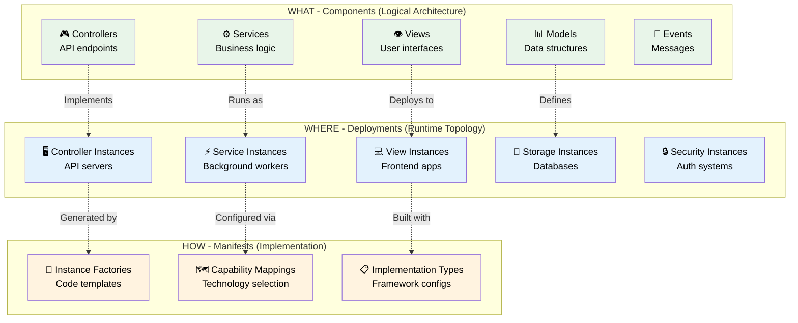
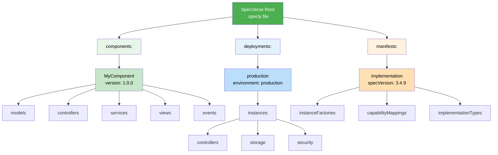
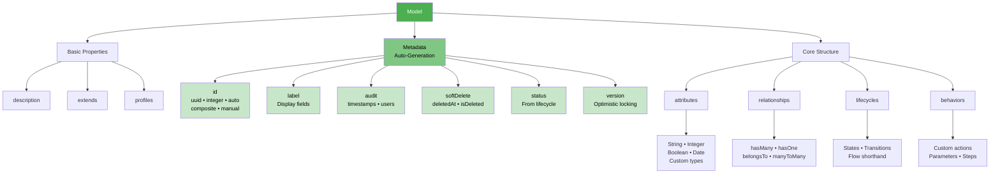
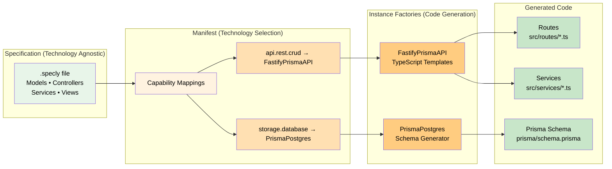

<!-- This file is auto-generated from schema/SPECVERSE-STRUCTURE-GUIDE.md
     Do not edit directly - changes will be overwritten
     To update: modify the source file and run 'npm run build' -->

# SpecVerse Structure Guide
*Version 3.4.9*

## Overview and Purpose

SpecVerse is a declarative specification language designed for seamless communication between humans and AI systems. It enables you to describe complete applications through specifications that define **what** needs to be done rather than **how** to do it.

### Core Roles and Concepts

**Specifications (.specly files)**: Define the logical architecture of your application - the models, business logic, and user interfaces. Think of this as your application's blueprint.

**Components**: Logical groupings of related functionality that form the building blocks of your application. Each component is self-contained and can be imported by others.

**Deployments**: Define how components are instantiated and run in real environments, from local development to enterprise production.

**Manifests**: Provide implementation guidance - which technologies to use, how to map specifications to real code, and deployment configurations. Manifests are integrated into the unified SpecVerse schema using the `manifests:` container format.

### Version 3.4.9 Key Features

**Unified Container Format**: All three architectural layers can coexist in a single .specly file:
- `components:` - Logical architecture (WHAT)
- `deployments:` - Runtime topology (WHERE)
- `manifests:` - Implementation guidance (HOW)

**Standardized Libraries**: Import from `@specverse/standards` for reusable patterns and types.

**Enhanced Import System**: Consistent import syntax across components and manifests for DRY architecture.

### The Three-Layer Architecture



## Top Level Structure

- **SpecVerse** has `components`, `deployments`, and/or `manifests`
- Must have at least one of these containers
- **Components** define the logical architecture
- **Deployments** define how to run components in production
- **Manifests** provide implementation guidance for components



## Components Container

Components are the core building blocks that contain your application's logical architecture.

- **Components** are named containers (can use namespaces like @org/package)
- Each **Component** has:
  - `version` (required) - semantic version like "1.0.0"
  - `description` - text description
  - `tags` - array of string tags
  - `import` - bring in types from other components
  - `export` - share types with others
  - `primitives` - custom primitive type definitions
  - `models` - data structures
  - `controllers` - request handlers
  - `services` - business logic
  - `views` - user interfaces
  - `events` - message payloads

## Primitives (Custom Types)

Primitives allow you to define reusable custom data types with built-in validation rules, reducing code duplication and ensuring consistency.

- **Primitives** define custom data types based on:
  - `baseType` - String, Integer, Number, or Boolean
  - `validation` rules:
    - `pattern` - regex pattern
    - `values` - enum values
    - `min`/`max` - numeric ranges
    - `format` - Email, URL, UUID, Date, Date-time

## Models

Models represent the core data structures of your application - the entities that your system manages and persists.

- **Models** have:
  - `description` - explains the model's purpose
  - `extends` - inherit from another model
  - `profiles` - attached profile models for reusable features
  - `metadata` - automatic field generation (id, audit, softDelete, status, version)
  - `attributes` - data fields
  - `relationships` - connections to other models
  - `lifecycles` - state machines
  - `behaviors` - custom actions
  - `profile-attachment` - configuration for attaching as profile to other models

## Attributes (in Models/Events)

Attributes define the data fields within models and events, including their types and validation constraints.

- **Attributes** have:
  - Type (String, Integer, Boolean, custom primitives, other models)
  - `required` or `optional`
  - `unique` - must be unique
  - `auto` - auto-generated value
  - `min`/`max` - value ranges
  - `default` - default value
  - `verified` - needs verification
  - `searchable` - can be searched
  - `values` - allowed values

## Model Metadata

Model metadata provides automatic generation of common synthetic attributes, reducing boilerplate and ensuring consistency.

- **Metadata options**:
  - `id` - ID generation strategy (auto, manual, composite, uuid, integer)
  - `label` - Field(s) to use as display label in UIs
  - `audit` - Enable audit fields (timestamps and optional user tracking)
    - `timestamps` - createdAt, updatedAt (default: true)
    - `users` - createdBy, updatedBy (default: false)
  - `softDelete` - Enable soft delete (deletedAt, isDeleted flags)
  - `status` - Status field from lifecycle or explicit values
  - `version` - Versioning for optimistic locking (integer or timestamp)

**Example:**
```yaml
User:
  metadata:
    id: uuid
    label: [firstName, lastName]
    audit:
      timestamps: true
      users: true
    softDelete: true
    version: true
  attributes:
    firstName: String required
    lastName: String required
    email: String required unique
```



## Relationships

Relationships define how models connect to each other, enabling you to express complex data associations.

- **Relationship types**:
  - `hasMany` - one to many
  - `hasOne` - one to one
  - `belongsTo` - many to one
  - `manyToMany` - many to many
- **Relationship options**:
  - `cascade` - cascade operations
  - `dependent` - delete dependent records
  - `eager` - load automatically
  - `lazy` - load on demand
  - `through` - join model for manyToMany

## Lifecycles

Lifecycles define state machines that govern how entities transition through different states during their lifetime.

- **Lifecycles** define state machines with:
  - `states` - list of states
  - `transitions` - how to move between states
  - OR `flow` - shorthand like "draft -> published -> archived"

## Behaviors (in Models)

Behaviors define custom actions that models can perform, encapsulating business logic at the model level.

- **Behaviors** are executable actions with:
  - `description` - explains what the behavior does
  - `parameters` - input attributes
  - `returns` - return type
  - `requires` - preconditions
  - `ensures` - postconditions
  - `publishes` - events published
  - `steps` - execution steps

## Controllers

Controllers handle incoming requests and define the API endpoints for interacting with your models.

- **Controllers** have:
  - `model` - which model they control
  - `path` - URL route
  - `description` - explains the controller's purpose
  - `subscribes_to` - events they listen to
  - `cured` - CRUD operations:
    - `create` - create new instances
    - `retrieve` - get single instance
    - `retrieve_many` - get multiple instances
    - `update` - modify existing instance
    - `evolve` - transform instance state
    - `delete` - delete instance
    - `validate` - validate data without side effects
  - `actions` - custom endpoints (same structure as behaviors)

## Services

Services contain reusable business logic that can be shared across controllers and triggered by events.

- **Services** have:
  - `description` - explains the service's purpose
  - `subscribes_to` - events they listen to
  - `operations` - business functions (same structure as behaviors)

## Views

Views define user interface components and how they present data to users.

- **Views** have:
  - `description` - explains the view's purpose
  - `type` - kind of UI (form, list, detail, dashboard)
  - `model` - data they display
  - `tags` - categorization tags
  - `export` - whether to export
  - `layout` - layout configuration
  - `subscribes_to` - events they listen to
  - `uiComponents` - UI components within the view (v3.5.0+, replaces `components`)
  - `properties` - view properties (responsive, authenticated, sortable, etc.)

## Events

Events define the structure of messages that flow through your system, enabling loose coupling between components.

- **Events** have:
  - `description` - explains when and why the event occurs
  - `attributes` - data payload (same as model attributes)

## Deployments Container

Deployments specify how your components are instantiated and configured for different environments.

- **Deployments** are named deployment configurations
- Each **Deployment** has:
  - `version` (required) - deployment specification version
  - `description` - explains the deployment's purpose
  - `environment` - development, staging, production, etc.
  - `instances` - running components organized by type

## Instances (in Deployments)

Instances represent the actual running components in a deployment, organized by their architectural role.

- **Instance categories**:
  - `controllers` - API servers handling requests
  - `services` - background services processing logic
  - `views` - frontend applications serving UI
  - `communications` - messaging systems for events
  - `storage` - databases and file storage
  - `security` - authentication and authorization systems
  - `infrastructure` - gateways, load balancers, CDNs
  - `monitoring` - metrics, logging, and alerting

## Common Instance Properties

All instances share these core configuration properties.

- `component` - which component to run
- `namespace` - logical namespace for isolation
- `scale` - number of instances to run
- `config` - configuration object
- `advertises` - capabilities provided to other instances
- `uses` - capabilities needed from other instances

## Storage Instances

Storage instances define how data is persisted, with options for different storage patterns and consistency models.

Additional properties:
- `type` - relational, document, keyvalue, cache, file, blob, queue, search
- `provider` - specific storage provider
- `persistence` - durable, session, cache, temporary
- `consistency` - strong, eventual, weak
- `replication` - number of replicas
- `backup` - enable backups
- `encryption` - encryption at rest

## Security Instances

Security instances handle authentication, authorization, and other security concerns.

Additional properties:
- `type` - authentication, authorization, encryption, audit, firewall, scanning, secrets, identity
- `provider` - oauth, saml, jwt, ldap, local, external, cloud, enterprise
- `scope` - global, component, namespace, instance, user, role
- `policies` - security policies to enforce
- `protocols` - supported security protocols
- `encryption` - none, basic, strong, enterprise
- `auditLevel` - none, basic, detailed, comprehensive

## Infrastructure Instances

Infrastructure instances provide networking, routing, and scaling capabilities.

Additional properties:
- `type` - gateway, loadbalancer, proxy, cdn, dns, registry, mesh, ingress
- `provider` - aws, gcp, azure, cloudflare, vercel, netlify, kubernetes, istio, envoy, nginx, traefik, consul, local
- `tier` - edge, regional, global, local
- `redundancy` - none, basic, high, enterprise
- `protocols` - supported network protocols
- `endpoints` - infrastructure endpoints
- `healthChecks` - enable health checking
- `autoScaling` - enable automatic scaling

## Monitoring Instances

Monitoring instances provide observability into your running system through metrics, logs, and traces.

Additional properties:
- `type` - metrics, logging, tracing, alerting, analytics, profiling, uptime, synthetic
- `provider` - prometheus, grafana, datadog, newrelic, splunk, elasticsearch, jaeger, zipkin, sentry, rollbar, cloudwatch, stackdriver, azure-monitor, local
- `scope` - global, component, namespace, instance, service, request
- `retention` - short, medium, long, permanent
- `resolution` - high, medium, low
- `sampling` - 0.0 to 1.0 sampling rate
- `dashboards` - dashboard templates to create
- `alerts` - alert rules to configure
- `exporters` - data exporters to enable
- `aggregation` - enable data aggregation
- `realtime` - enable real-time monitoring

## Communication Instances

Communication instances provide messaging infrastructure for event-driven architecture.

- `capabilities` - capabilities available on this channel
- `type` - pubsub, streaming, rpc, queue
- `namespace` - logical namespace
- `config` - channel-specific configuration

## Instance Factories

Instance Factories are reusable technology specifications that define how to generate code for deployment instances. They are the bridge between technology-agnostic specifications and concrete implementations.

### Purpose

Instance Factories enable the "Define Once, Implement Anywhere" philosophy by:
- Defining code generation templates for specific technology stacks
- Specifying dependencies and configuration requirements
- Providing capability-based matching for automatic selection
- Supporting multiple template engines (TypeScript, Handlebars, AI)

### Structure

Each Instance Factory has:
- `name` (required) - unique name (e.g., "FastifyPrismaAPI", "NextJSApp")
- `version` (required) - semantic version
- `category` (required) - which instance type it implements (controller, service, view, storage, etc.)
- `capabilities` (required) - what capabilities it provides and requires
  - `provides` - capabilities this factory offers (e.g., "api.rest.crud", "storage.database")
  - `requires` - capabilities this factory needs from other instances
- `technology` (required) - technology stack information
  - `runtime` - execution environment (node, deno, bun, browser, etc.)
  - `language` - programming language (typescript, javascript, python, etc.)
  - `framework` - framework name (fastify, express, nextjs, react, etc.)
  - `database` - database system (postgresql, mongodb, etc.)
- `codeTemplates` (required) - code generation templates
  - Template engine: `typescript`, `handlebars`, or `ai`
  - Output patterns with variable substitution
  - Validators and post-processors
- `dependencies` - runtime, dev, and peer dependencies
- `configuration` - default configuration values
- `requirements` - generic requirements for scaffolding (environment variables, files, etc.)

**Example:**
```yaml
name: "FastifyPrismaAPI"
version: "1.0.0"
category: "controller"
capabilities:
  provides:
    - "api.rest.crud"
    - "api.rest"
  requires:
    - "storage.database"
technology:
  runtime: "node"
  language: "typescript"
  framework: "fastify"
  database: "postgresql"
codeTemplates:
  routes:
    engine: "typescript"
    generator: "./templates/routes-generator.ts"
    outputPattern: "src/routes/{modelName}.ts"
  services:
    engine: "typescript"
    generator: "./templates/services-generator.ts"
    outputPattern: "src/services/{modelName}Service.ts"
```

### Usage in Manifests

Instance Factories are referenced in manifests through capability mappings:

```yaml
capabilityMappings:
  - capability: "api.rest.crud"
    instanceFactory: "FastifyPrismaAPI"
  - capability: "storage.database"
    instanceFactory: "PrismaPostgres"
```

This enables flexible technology selection while maintaining specification independence.



## Manifests Container

Manifests provide implementation guidance for SpecVerse specifications, bridging the gap between logical architecture and concrete implementations. Manifests are integrated into the unified SpecVerse schema.

### Unified Architecture

- **Manifests** are named containers (similar to components)
- Each **Manifest** has:
  - `specVersion` (required) - "3.4.9"
  - `name` (required) - manifest name
  - `description` (required) - manifest description
  - `version` (required) - semantic version
  - `component` - reference to SpecVerse component
  - `deployment` - reference to SpecVerse deployment
  - `import` - import standard definition libraries
  - `implementationTypes` - reusable technology implementations
  - `behaviorMappings` - model behavior implementation paths
  - `capabilityMappings` - capability to implementation mappings
  - `communicationChannels` - channel implementation mappings
  - `logicalDeployment` - deployment instance mappings
  - `namespaceConfiguration` - namespace scoping rules

### Technology-Specific Extensions

Manifests can include technology-specific extensions for framework details:

- `targets` - technology stack choices (frontend, backend, infrastructure)
- `routeMapping` - HTTP route mappings (REST API specific)
- `implementationPolicies` - validation, error handling, testing strategies
- `deploymentPolicies` - scaling, health checks, resilience patterns
- `generationHints` - code generation preferences
- `aiInstructions` - AI-specific implementation guidance

### Architecture Separation

**Core Schema (Protocol-Agnostic):**
- Logical architecture definitions
- Implementation type patterns
- Capability and communication mappings

**Technology Extensions:**
- HTTP routing (REST API specific)
- Framework-specific configurations
- Deployment and scaling policies

---

This guide provides a complete reference to the SpecVerse structure. Each section represents a key building block in creating comprehensive application specifications that can be understood by both humans and AI systems, enabling efficient collaboration in software development.